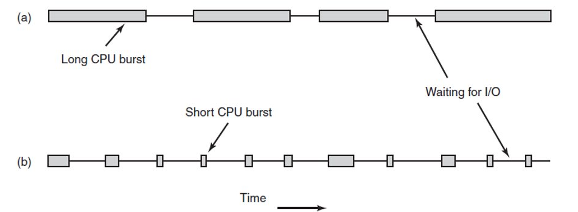
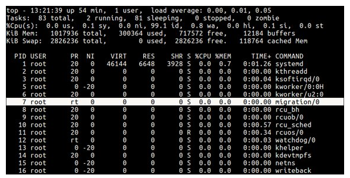

# Scheduling

    Course Code: ELEE1119 
    
    Course Name: Advanced Computer Engineering

    Credits: 30

    Module Leader: Seb Blair BEng(H) PGCAP MIET MIHEEM FHEA

---

## What is Scheduling

- The responsibility of determining how to allocate processor time among all the ready processes is known as “**process scheduling**” ​

- OS has the task to determine  optimum sequence and timing of assigning processes to the processor. ​

- There are two main approaches to scheduling :​
  - Preemptive​
  - Non-preemptive  ​

---

## Preemptive and Non-preemptive

- **Preemptive​**
  - Approach is accomplished by dividing time into short segments, each called a time slice or quantum and then switching the CPU's attention among the processes as each is allowed to execute for no longer than **one time slice**.​

- **non-preemptive**
  - Approach processes are given control of the processor until they complete execution or voluntarily move themselves to a different state.​

---

## One Last Thing...

​In **non-preemptive** technique processes may not voluntarily cooperate with one another.

This problem is especially serious if the running process happens to be executing an infinite loop containing no resource requests.

The process will never give up the processor, so all ready processes will wait forever.​

---

## Scheduling Strategies or Policies

Some well known strategies/policies: ​

- First-Come-First-Served(FSFS)​

- Shortest Job First (SJF)​

- Shortest Job Next (SJN)​

- Round Robin (RR)​

--- 

## FCFS

- First Come First Served:​
  - This non-preemptive scheduling algorithm follows the first-in, first-out (FIFO) policy.​ 
  - As each process becomes ready, it joins the ready queue.
  - When the current running process finishes execution, the oldest process in the ready queue is selected to run next.

---

## FCFS Analysis

- Assume three processes arrived at the ready queue in the following order ​

      Process 1 (P1) ->Estimated Run Time: 24​

      Process 2 (P2)->Estimated Run Time: 3 ​

      Process  3 (P3)->Estimated Run Time: 3 ​

- For analysis,  let’s assume unit as “milliseconds”.​

- The required  CPU time or estimated run time is also known as “CPU Burst time”.
      

---

## Introduction to Scheduling Process Behaviour

Bursts of CPU usage alternate with periods of waiting for I/O. ​

 - (a) CPU-bound process. ​
 
 - (b) An I/O-bound process.​

---

## Waiting Time in FCFS

If the processes arrive in the order P$_1$, P$_2$, P$_3$ and are served in FCFS order, we get the result shown in the following **Gantt chart**, which is a bar chart that illustrates a particular schedule, including the start and finish times of each of  the participating processes:​

The waiting time is 0 milliseconds for process P$_1$, 24 milliseconds for process P$_2$, and 27 milliseconds for process P$_3$. Thus, the average waiting time is (0+ 24 + 27)/3 = 17 milliseconds.

---

## Waiting Time FCFS Cont.

If the processes arrive in the order P$_2$, P$_3$, P$_1$, however, the results will be as shown in the following Gantt chart:​

The average waiting time is now (6 + 0 + 3)/3 = 3 milliseconds. This reduction is substantial. Thus, the average waiting time under an FCFS policy is generally not minimal and may vary substantially if the processes’ CPU burst times vary greatly.​

--- 

## Shortest Job First (SJF)

- Shortest Job First (SJF) ​
  - This **non-preemptive** scheduling algorithm favours processes with the shortest expected execution time. SJF algorithm can be **preemptive**, in this case, new processes that enter to the ready queue can take the place of the running process.​
  - It is a **priority scheme** where priority is the inverse of the estimated run time.​
  - It yields the smallest average waiting time. ​
---

## SJF Analysis

As an example of SJF scheduling, consider the following set of processes, with the length of the CPU burst time (assume milliseconds for analysis if no time unit is given):​

|Process| Burst Time| 
|----|----|
|P$_1$|6|
|P$_2$|8|
|P$_3$|7|
|P$_4$|3|

Burst Time means estimated run time

---

## Waiting Time in SJF

Using SJF scheduling, we would schedule these processes according to the following Gantt chart:​

​

The waiting time is 3 milliseconds for process P$_1$, 16 milliseconds for process P$_2$, 9 milliseconds for process P$_3$, and 0 milliseconds for process P$_4$. Thus, the average waiting time is (3 + 16 + 9 + 0)/4 = 7 milliseconds. By comparison, if we were using the FCFS scheduling scheme, the average waiting time would be 10.25 milliseconds.​

---

## SJF Notes

 - Moving a short process before a long one decreases the waiting time of the short process more than it increases the waiting time of the long process.​

- Consequently, the average waiting time decreases.​​

---

## Round Robin (RR)

- Round Robin​
  - This scheduling policy gives each process a slice of time (i.e., one quantum) before being preempted. ​
  - A time quantum is generally from 10 to 100 milliseconds in length​
  - The ready queue is treated as a circular queue. ​
  - The CPU scheduler goes around the ready queue, allocating the CPU to each process for a time interval of up to 1 time quantum. ​

---

## Equal Time Share in RR

- As each process becomes ready, it joins the ready queue. A clock interrupt is generated at periodic intervals.​

- When the interrupt occurs, the currently running process is preempted, and the oldest process in the ready queue is selected to run next. ​

---

## Notes on RR

- Conisder the following set of processes arrives at the ready queue in the order shown (P$_1$, P$_2$,P$_3$), with the length of estimated run time or CPU burst

|Process| Burst Time| 
|----|----|
|P$_1$|24|
|P$_2$|3|
|P$_3$|3|

- For analysis, assume time unit as ms and time quantum as 10ms

---

## Round Robin Scheduling 

- If we use a time quantum of 10ms, then P$_1$ gets the first 10ms. Since it requires another 14ms, it is preempted after the first time quantum, and the CPU is given to the next process in the queue, process P$_2$
- Process P$_2$ does not need 10ms, so it quites before its time quantum expires.
- The CPU is then given to the next process, process P$_3$
- Once each process has received 1 time quantum, the CPU is returned to process P$_1$ for an additional time quantum.
- THe resulting RR schedule is as follows:

---

## Waiting Time in RR

- Let’s calculate the average waiting time for this schedule. ​

 - P$_1$ waits for 6ms (16 - 10), P$_2$ waits for 10ms, and P$_3$ waits for 13ms. Thus, the average waiting time is 29/3 = 9.66ms.​

- Important to note that results would be different if a different time quantum was chosen instead of 10ms. ​

---

## RR is Preemptive

- In the RR scheduling algorithm, no process is allocated the CPU for more than 1 time quantum in a row
- If a process's CPU burst exceeds 1 time quantum, that process is preempted and is put back in the ready queue. The RR scheduling algorithm is this preemptive.
- The performance of the RR algorithm depends heavily on the size of the time quantum. At one extreme, if the time quantum is extremely large, the RR policy is the same as the FCFS policy

---

## Context Switchin in RR

- If the time quantum is extremely small (say, 1ms), the RR approach can result in a large numbe of context switches.
- Assume, for example. that we have only one process of 10 time units. If the quantum is 12 time units, the process finishes in less than 1 time quantum, with no overhead.
- If the quantum is 6 time units, however, the process requires 2 quanta, resulting in  context switch.

---

## Process Table

- To keep track of the state of all the processes, the OS maintains a table known as the **process table** which is a list of all the processes with resources the processes are using and the current state of each process.​

- Every time a process changes it states all information related to that process needs to be saved in the process table. ​

- The procedure of  swapping processes and switching over their states are known as **“process switching”** or **“context switching”** which involves saving/retrieving information of a process to/from a process table.  ​

---

## Multilevel Queue Schedule

A multi-level queue scheduling technique partitions or divides the ready queue into many separate queues. ​

The processes get permanently assigned to one queue, usually based on some property of the process, such as the size of the memory, process priority and/or type of process. 

---

## Process Table

i- To keep track of the state of all the processes, the OS maintains a table known as the **process table** which is a list of all the processes with resources the processes are using and the current state of each process.​

- Every time a process changes it states all information related to that process needs to be saved in the process table. ​

- The procedure of  swapping processes and switching over their states are known as **“process switching”** or **“*context switching”** which involves saving/retrieving information of a process to/from a process table.  ​

---
## Processes

---

## Being NICE

- Linux systems routinely run more processes than there are processing units in the computer. Because of this, the process scheduler will quickly jump between processes on a single core, thus creating the illusion that we are running multiple, simultaneous processes​
  
- 40 point scale used to measure the nice levels of a process.​

- The nice level is a unit of measure that describes the relative priority of the process. ​

- A process inherits its nice level from the parent (most often 0).​A process inherits its nice level from the parent (most often 0).​

---

## Calculating Processes NICEness

- 140 priorities
- nice vales range from -20 (Highest) to 19 (Lowest) priority, 0 is defaut 
- Real time priority range(PR or PRI):  0 to 99 ​
- User space priority range: 100 to 139
- RT means the process is running under real-time scheduling priority

---
## NICEness formula

$$
    \begin{aligned}
     PR &= 20 + NI\\
     PR &= 20 + (-20\  to\  +\  19) \\
     PR &= 0\ to\ 30 \equiv 100\ to\ 139 \\
    \end{aligned}
$$