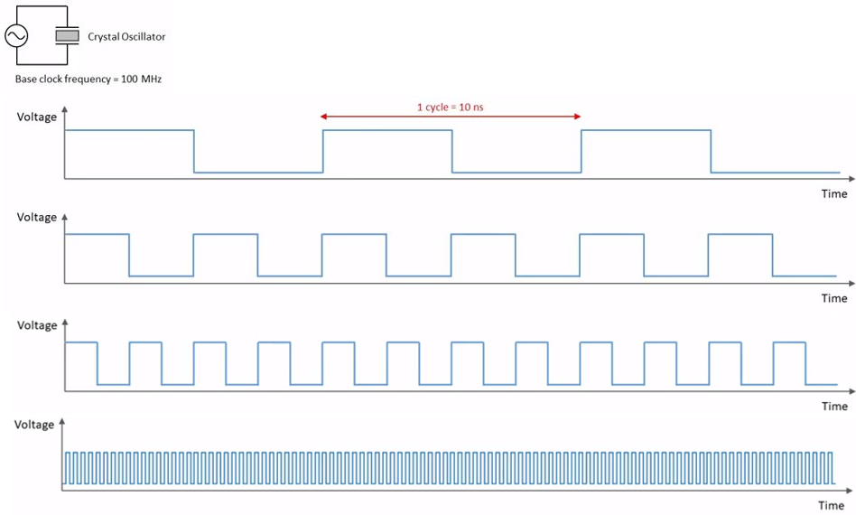

# CPU Governors and Frequencies

    Course Code: ELEE1119 
    
    Course Name: Advanced Computer Engineering

    Credits: 30

    Module Leader: Seb Blair BEng(H) PGCAP MIET MIHEEM FHEA
    

---

## Crystal Oscillator -  Base Clock

- 100 million times a second – cycle is 10ns​

- Base clock, tempo, is multiplied by a frequency multiplier to increase the rate of instructions executed​

- Multiplying by 35 we get 3.5Ghz, which 0.3ns per cycle​
  


---

## Clock Speeds

The clock speed measures the number of cycles your CPU executes per second, measured in GHz or MHz (giga/megahertz).

A “cycle” is technically a pulse synchronized by an internal oscillator, but for our purposes, they’re a basic unit that helps understand a CPU’s speed. During each cycle, billions of transistors within the processor open and close.


---

## Clock Speeds

<div align=right>

$T = \frac{1}{f}$

</div>

1. So how fast is the Intel i5-1135G7 @ 4.2GHz?

<details>
<summary>Answer</summary>

$$
\begin{equation*}
    
    238.1ps \leftarrow 2.381 \cdot 10^{-10} = \frac{1}{4.2 \cdot 10^9} \equiv \frac{1}{4.2GHz}
\end{equation*}
$$

</details>

1. or ARM Cortex-A72 @ 1.5GHz

<details>
<summary>Answer</summary>

$$
\begin{equation*}
    666.7ps \leftarrow 6.6667 \cdot 10^{-10} = \frac{1}{1.5 \cdot 10^9} \equiv \frac{1}{1.5GHz}
\end{equation*}
$$

</details>


---

## Frequency Locations

```sh
/sys/devices/system/cpu/cpu#/cpuFreq/scaling_cur_freq
/sys/devices/system/cpu/cpuFreq/scaling_cur_freq
/sys/devices/system/cpu/*
```

```sh
$ cat /sys/devices/system/cpu/cpu*/cpufreq/scaling_cur_freq
```
```sh
1422065
3236006
2477400
1580429
1300215
1245918
1200226
1200471
```

<!--
What unit is this in, kHz, MHz,GHz
-->

---
## Setting Speeds.... 

```sh
## Govenor should be set as userspace to use.

# change the operating freq of nodes update min and max to be the same to ensure true speed. 
FREQ=$1
CPU="/sys/devices/system/cpu/"
MAX="scaling_max_freq"
MIN="scaling_min_freq"

CORES=$(lscpu | grep -w "CPU(s):*" | awk 'NR==1 {print$2}')
# make sure in sudo mode
sudo echo
for (( c=0; c<${CORES}; c++))
do
    echo -e ${FREQ} > ${CPUDIR}cpu${C}/cpufreq/${MIN}
    echo -e ${FREQ} > ${CPUDIR}cpu${C}/cpufreq/${MAX}
done

```

---

## CPU Performance: Cycles Per Instruction (CPI)

Computers run synchronously utilising a CPU clock running at a constant clock rate: 

<div align=center>


</div>


Each instruction is compromised of a number of elementary or micro operations which vary in number and complexity depending on the instruction. 

So a single machine instruction may take one or more CPU cycles to complete -> Cycles Per Instruction (CPI)


<!--

The CPU clock rate depends on the specific CPU organisation and implementation technology. 

Clock rate is 1/cycle
-->
---

## Comparing Computer Performance Using Execution Time


To compare the performance of two CPUs “A”, ”B” running a given specific program

<div style="font-size:22px">

$$ Performance_A=\frac{1}{ExecutionTime_A}$$
$$Perfromance_B=\frac{1}{ExecutionTime_B}$$

</div>
Machine A is n times faster than Machine B means (or slower ? If n > 1):

<div style="font-size:22px">
<p>
</p>

$$SpeedUp = n => \frac{Performance_A}{Performance_A}=\frac{ExecutionTime_A}{ExecutionTime_B}$$
</div>

For example:

<div style="font-size:22px">

$$10x≡10=\frac{10_{CPU_B}}{1_{CPU_A}}$$

</div>

---

## CPU Execution Time Pt1

A program is compromised of a number of instructions executed:
- Measured in : instructions/program, **I**

The average instruction executed takes a number of cycles per instruction (CPI) to be completed:
- Measured in: cycles/instruction, **CPI**

CPU has a fixed clock cycle time C = **1/clock rate**:
- Measured in: seconds/cycle

CPU execution time is the product of the above three parameters as follows:

$$CPU_T = \frac{Instructions}{Program} \cdot \frac{Cycles}{Instruction}\cdot\frac{Seconds}{Cycle}$$

<p>
</p>

$$T = I \cdot CPI \cdot C$$

<!--
T = Exection Time per program in seconds
I = Number of instructions executed 
C/I = Avg CPI for program 
Sec/C = CPU Clock Cycle
-->

---

## CPU Execution Time Pt2

<div style="font-size:22px">

$$CPU_T = \frac{Instructions}{Program} \cdot \frac{Cycles}{Instruction}\cdot\frac{Seconds}{Cycle}$$

</div>

So if the Instructions is 1 Billion, 1000MHz, and execution time of 3 seconds what is the CPI?

<div style="font-size:22px">

$$ 3 = \frac{3}{(1\cdot 10^9) \cdot \frac{1}{1\cdot 10^9}}$$

</div>

Now suppose we reduce the CPI to 1.2 through architectural improvement, what is the new execution time?

<div style="font-size:22px">

$$ 1.2s \equiv \frac{6}{5} = 1.2 \cdot (1\cdot 10^9)*1 \cdot 10^{-9}$$

</div>

Therefore we have improved the performance by ->

<div style="font-size:22px">

$$60\% \equiv \frac{1.2 -3s}{3s}\cdot 100$$ 
$$2.5 faster \equiv \frac{3}{1.2}$$ 

</div>

---

## CPU Execution Time For a Bash Script

<div style="font-size:22px">

$$CPU_T = \frac{Instructions}{Program} \cdot \frac{Cycles}{Instruction}\cdot\frac{Seconds}{Cycle}$$

</div>

So if the Instructions is 100,  CPI  is 2.5, Clock cycle is 1400MHz what is the Execution Time:

<details>
<summary>Answer</summary>

$$178ns = 100 \cdot 2.5 \cdot (1.4 \cdot 10^9)$$

</details>

---

## Factors Affecting the CPU Performance

<p>

</p>

<div style="font-size:22px">

$$CPU_T = \frac{Instructions}{Program} \cdot \frac{Cycles}{Instruction}\cdot\frac{Seconds}{Cycle}$$

</div>

<p>

</p>

<div align=center style="font-size:22px">

||**Instruction Count $I$** |**CPI**|**Clock Cycle**|
|--|:--:|:--:|:--:|
|**Program**|x|x||
|**Compiler**|x|x||
|**Instruction Set Architecture (ISA)**|x|x||
|**Organistaion**||x|x|
|**Technology(VSLI)**|||x|
|**Programmer**|x|s|x|

</div>

<!--
ISA acts as an interface between the hardware and the software, specifying both what the processor is capable of doing as well as how it gets done.

supported data types, the registers, how the hardware manages main memory, key features (such as virtual memory), which instructions a microprocessor can execute, and the input/output model of multiple ISA implementations. The ISA can be extended by adding instructions or other capabilities, or by adding support for larger addresses an

Very large-scale integration (VLSI) is the process of creating an integrated circuit (IC) by combining millions or billions of MOS transistors onto a single chip

-->
---


## CPU Frequency Governors PT1

However all this speed comes at the expense of components, power and heat. 

So can we manage the speed of the CPU to offset the heat produced through the relationship of power?

What if we could change the speed of the clock programmatically?

---

## CPU Frequency Governors PT1

- One of the most effective ways to reduce power consumption and heat output on your system is to use **CPUfreq**. 
  - **CPUfreq** — also referred to as CPU speed scaling allows the clock speed of the processor to be adjusted on the fly. 

- This enables the system to run at a reduced clock speed to save power. The rules for shifting frequencies, whether to a faster or slower clock speed, and when to shift frequencies, are defined by the **CPUfreq** **governor**.

- The **governor** defines the power characteristics of the system CPU, which in turn affects CPU performance. 

- Each governor has its own unique behaviour, purpose, and suitability in terms of workload. 

---

## The Concept of CPU Performance Scaling PT1

- The majority of modern processors are capable of operating in a number of different clock frequency and 
voltage configurations =  **P-states**, **Performance-states**

- As a rule, the higher the **clock frequency** and the higher the **voltage**.

- Therefore there is a natural trade-off between the CPU **capacity** (the **number of instructions** that can be 
executed over a **unit of time**) and the **power drawn** by the CPU

---

## CPU Initialisation Flow...




<!--
- First of all, a scaling driver has to be registered for CPUFreq to work. It is only possible to register
one scaling driver at a time, so the scaling driver is expected to be able to handle all CPUs in the 
system.

- The scaling driver may be registered before or after CPU registration. If CPUs are registered 
earlier, the driver core invokes the CPUFreq core to take a note of all of the already registered CPUs 
during the registration of the scaling driver. In turn, if any CPUs are registered after the registration 
of the scaling driver, the CPUFreq core will be invoked to take note of them at their registration time.

- In turn, if a previously offline CPU is being brought back online, but some other CPUs sharing the 
policy object with it are online already, there is no need to re-initialize the policy object at all. In that 
case, it only is necessary to restart the scaling governor so that it can take the new online CPU into 
account. That is achieved by invoking the governor’s ->stop and ->start() callbacks, in this order, for 
the entire policy.
-->
---

## CPU Initialisation

- It also may not be physically possible to maintain **maximum** CPU **capacity** for too long for **thermal** or **power** supply **capacity** reasons or similar. 

- To cover those cases, there are hardware interfaces allowing CPUs to be switched between  **different** frequency/voltage **configurations**) or to be put into different P-states.

- Typically, they are used along with **algorithms** to **estimate** the required CPU **capacity**, so as to decide which P-states to put the CPUs into.

- Of course, since the utilisation of the system generally **changes** over time, that has to be done **repeatedly** on a **regular** basis. 

- The activity by which this happens is referred to as CPU **performance scaling** or CPU **frequency scaling** (because it involves **adjusting** the **CPU clock frequency**)

---

## Policy Interface in `sysfs`

- During the initialisation of the **kernel**, the CPUFreq core creates a sysfs directory (kobject) called cpufreq under `/sys/devices/system/cpu/`.

- That directory contains a **policyX** subdirectory (where X represents an integer number) for every policy object maintained by the CPUFreq core. 

- Each **policyX** directory is pointed to by cpufreq symbolic links under `/sys/devices/system/cpu/cpuY/` (where represents an integer that may be different from the one represented by X) for all of the CPUs associated with (or belonging to) the given policy. 

- The **policyX** directories in `/sys/devices/system/cpu/cpufreq` each contain policy-specific attributes (files) to control CPUFreq behaviour for the corresponding policy objects (that is, for all of the CPUs associated with them).

---

## Policies in `sysfs` 1/8

**affected_cpus**
- List of online CPUs belonging to this policy (i.e. sharing the hardware performance scaling interface represented by the policyX policy object).

**bios_limit**
- If the platform firmware (BIOS) tells the OS to apply an upper limit to CPU frequencies, that limit will be reported through  this attribute (if present).
 -The existence of the limit may be a result of some (often unintentional) BIOS settings, restrictions coming from a service processor or another BIOS/HW-based mechanisms.
- This does not cover ACPI thermal limitations which can be discovered through  a generic thermal driver.
- This attribute is not present if the scaling driver in use does not support it.
---

## Policies in `sysfs` 2/8

**cpuinfo_cur_freq**
- Current frequency of the CPUs belonging to this policy as obtained from the hardware (in KHz)
- This is expected to be the frequency the hardware actually runs at. If that frequency cannot be determined, this attribute should not be present.

**cpuinfo_max_freq**
- Maximum possible operating frequency the CPUs belonging to this policy can run at (in kHz).

**cpuinfo_min_freq**
- Minimum possible operating frequency the CPUs belonging to this policy can run at (in kHz).

--- 

## Policies in `sysfs` 3/8

**cpuinfo_transition_latency**
- The time it takes to switch the CPUs belonging to this policy from one P-state to another, in nanoseconds.
- If unknown  or if known to be so high that the scaling driver does not work with the ondemand governor, -1 (CPUFREQ_ETERNAL) will be returned by reads from this attribute.

**related_cpus**
- List of all (online and offline) CPUs belonging to this policy.


---- 

## Policies in `sysfs` 4/8

**scaling_available_governors**
- List of CPUFreq scaling governors present in the kernel that can be attached to this policy or (if the intel_pstate scaling driver is in use) list of scaling algorithms provided by the driver that can be applied to this policy.
- [Note that some governors are modular and it may be necessary to load a kernel module for the governor held by it to become available and be listed by this attribute.]

---

## Policies in `sysfs` 5/8

**scaling_cur_freq**
- Current frequency of all of the CPUs belonging to this policy (in kHz).
- In the majority of cases, this is the frequency of the last P-state requested by the scaling driver from the hardware using the scaling interface provided by it, which may or may not reflect the frequency the CPU is actually running at (due to hardware design and other limitations).
- Some architectures (e.g. x86) may attempt to provide information more precisely reflecting the current CPU frequency through  this attribute, but that still may not be the exact current CPU frequency as seen by the hardware at the moment.

----

## Policies in `sysfs` 6/8

**scaling_driver**
-  The scaling driver currently in use.

**scaling_governor**
- The scaling governor currently attached to this policy or (if the intel_pstate scaling driver is in use) the scaling algorithm provided by the driver that is currently applied to this policy.
- This attribute is read-write and writing to it will cause a new scaling governor to be attached to this policy or a new scaling algorithm provided by the scaling driver to be applied to it (in the intel_pstate case), as indicated by the string written to this attribute (which must be one of the names listed by the scaling_available_governors attribute described above).

----

## Policies in `sysfs` 7/8

**scaling_max_freq**
- Maximum frequency the CPUs belonging to this policy are allowed to be running at (in kHz).
- This attribute is read-write and writing a string representing an integer to it will cause a new limit to be set (it must not be lower than the value of the scaling_min_freq attribute).

**scaling_min_freq**
- Minimum frequency the CPUs belonging to this policy are allowed to be running at (in kHz).
- This attribute is read-write and writing a string representing a non-negative  integer to it will cause a new limit to be set (it must not be higher than the value of the scaling_max_freq attribute).

---

## Policies in `sysfs` 8/8

**scaling_setspeed**
- This attribute is functional only if the userspace scaling governor is attached to the given policy.
- It returns the last frequency requested by the governor (in kHz) or can be written to in order to set a new frequency for the policy

---

## Generic Scaling Governors

- CPUFreq provides generic **scaling governors** that can be used with all **scaling drivers**.  As stated before, each of them implements a single, possibly parametrised, performance scaling algorithm.

- **Scaling governors** are attached to policy objects and different policy objects can be handled by different scaling governors at the same time (although that may lead to suboptimal results in some cases).

-  The **scaling governor** for a given policy object can be changed at any time with the help of the **scaling_governor** policy attribute in **sysfs**.

- Some governors expose **sysfs** attributes to control or fine-tune the scaling algorithms implemented by them. 

---

## Generic Scaling Governors  1/4

**performance**
- When attached to a policy object, this governor causes the **highest frequency**, within the **scaling_max_freq** policy limit, to be requested for that policy.
- The request is made once at that time the governor for the policy is set to performance and whenever the **scaling_max_freq** or **scaling_min_freq** policy limits **change** after that.

**powersave**
- When attached to a policy object, this governor causes the **lowest frequency**, within the **scaling_min_freq** policy limit, to be requested for that policy.
- The request is made once at that time the governor for the policy is set to **powersave** and whenever the **scaling_max_freq** or **scaling_min_freq** policy limits **change** after that.

---

## Generic Scaling Governors 2/4

**userspace**
- This governor does not do anything by itself. Instead, it allows **user space** to set the **CPU frequency** for the  policy it is attached to by writing to the **scaling_setspeed** attribute of that policy.

**schedutil**
- This governor uses **CPU utilisation** data available from the **CPU scheduler**. It generally is regarded as a  part of the CPU scheduler, so it can access the scheduler’s **internal data structures directly**.

- It runs entirely in scheduler context, although in some cases it may need to invoke the scaling driver  **asynchronously** when it decides that the CPU frequency should be changed for a given policy (that depends  on whether or not the driver is capable of changing the CPU frequency from scheduler context).

----

## Generic Scaling Governors 3/4

**ondemand**
- This governor uses **CPU load** as a **CPU frequency** selection metric.

- In order to **estimate** the **current CPU** load, it measures the time elapsed between **consecutive invocations** of its worker routine and **computes the fraction of that time** in which the given CPU was **not idle**. The ratio of the non-idle (active) time to the total CPU time is taken as an estimate of the load.

- If this governor is attached to a policy shared by multiple CPUs, the load is estimated for all of them and the greatest 
result is taken as the load estimate for the entire policy.

----

## Generic Scaling Governors 4/4

**conservative**
- This governor uses **CPU load** as a **CPU frequency** selection metric.
 
- It estimates the CPU load in the **same** way as the ondemand governor described above, but the CPU frequency 
selection **algorithm implemented** by it is **different**.

-  Namely, it **avoids changing** the **frequency** significantly over **short time intervals** which may not be suitable for systems with limited power supply capacity (e.g. battery-powered). To achieve that, it changes the frequency in relatively small steps, one step at a time, up or down - depending on whether or not a (configurable) threshold has been exceeded by the estimated CPU load.

---
## Script to see all available cores' frequencies and governor

```sh
CPUDIR=/sys/devices/system/cpu/cpu0/cpufreq/
NTHCORE=$(lscpu | grep -w "CPU(s):*" | awk 'NR==1 {print$2}')
COLUMNS=''
HEADER="SCPU Policies\t| CORES 0:${NTHCORE}-->"

for (( c=0; c<=${NTHCORE}; c++ ))
do
  COLUMNS="${COLUMNS} -"
done

echo -e ${HEADER}

for i in ${CPUDIR}{cpuinfo,scaling}_*; do #iterate over the all cput frequencies
  PNAME=$(basename $i)

  [[ "${PNAME}" == *available* ]] || [[ "${PNAME}" == *transition* ]] || \
  [[ "${PNAME}" == *driver* ]]    || [[ "${PNAME}" == *setspeed* ]] && continue

  echo "${PNAME}: "

  for (( j=0; j<${NTHCORE}; j++ ))
  do
  # replace cpu0 with cpuj for  /sys/devices/system/cpu/cpuj/cpufreq...
    KPARAM=$(echo $i | sed "s/cpu0/cpu$j/") 
    cat "${KPARAM}"
  done
done | paste ${COLUMNS} | column -t
```


----

## Setting governors 

```sh
GOVDIR="/sys/devices/system/cpu/cpu*/cpufreq/scaling_governor"
AVAILGOVS=$(cat /sys/devices/system/cpu/cpu0/cpufreq/scaling_available_governors)
CORES=$(lscpu | grep -w "CPU(s):*" | awk 'NR==1 {print$2}')

while [[ 1 ]]; do
        echo "Please select from the following governors:"
        echo  "${AVAILGOVS}"

        read GOV
        # use grep to match input with sub string of AVAILGOVS
        if grep -q "$GOV" <<< "${AVAILGOVS}"; then
                break
        fi
done

echo -n "Changing the scaling_governor all ${CORES} to "

echo "${GOV}" | sudo tee ${GOVDIR}
echo "Success your new Scaling Governor is ${GOV}"   
```