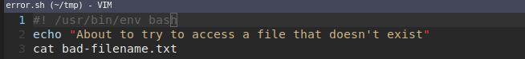
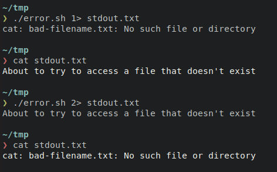
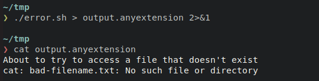

# Data Streams

    Course Code: ELEE1119

    Course Name: Advanced Computer Engineering

    Credits: 30

    Module Leader: Seb Blair BEng(H) PGCAP MIET MIHEEM FHEA

---

## Data Streams Pt1

- Data streams, like water streams, have two ends. ​

- They have a source and an outflow. ​

- Whichever Linux command you’re using provides one end of each stream. ​

- The other end is determined by the shell that launched the command. ​

- That end will be connected to the terminal window, connected to a pipe, or redirected to a file or other command, according to the command line that launched the command.​

---

## Data Streams Pt2

- Standard Input​
  - stdin is inherited from the parent process​

- Standard Output​
  - stdin is inherited from the parent process​

- Standard Error​
  - typically used by programs to output error messages or diagnostics ​

​

<!-- 
stdin and stdout: unless redirected 

stderr stream is independent to stdout and therefore can be redirected separately..
-->
---

## Linux Standard Streams

- In Linux, `stdin` is the standard input stream. This accepts text as its input. Text output from the command to the shell is delivered via the `stdout` (standard out) stream. Error messages from the command are sent through the `stderr` (standard error) stream.​​

- So you can see that there are two output streams, `stdout` and `stderr`, and one input stream, `stdin`. Because error messages and normal output each have their own **conduit** to carry them to the terminal window, they can be handled independently of one another.​

---
## Streams ​are handled like files Pt1

- Each file associated with a process is allocated a unique number to identify it. This is known as the **file descriptor**. Whenever an action is required to be performed on a file, the **file descriptor** is used to identify the file.​

- These values are always used for `stdin`, `stdout`, and `stderr`:​
  - 0: `stdin​`
  - 1: `stdout`​
  - 2: `stderr​`

<!-- ​Streams in Linux, like almost everything else, are treated as though they were files. You can **read** text from a file, and you can write text into a file. Both of these actions involve a **stream** of data. -->

---
## Streams ​are handled like files Pt1

- When talking about stdin, stdout, and stderr it is convenient to trot out the accepted axiom that a process neither knows nor cares where its three standard streams are terminated. ​
  - Should a process care whether its output is going to the terminal or being redirected into a file? ​
  - Can it even tell if its input is coming from the keyboard?​
  - Or is being piped into it from another process?​

- Actually, a process does know,or at least it can find out, should it choose to check,and it can change its behaviour accordingly if the software author decided to add that functionality.​

---

## `ls` stdout and piped `|`

​The `ls` command behaves differently if its output (stdout) is being **piped**, `|`, into another command. It is ls that switches to a single column output, it isn’t a conversion performed by `cat`. ​

---

## `ls` redirection `>` or `>>`

`ls` does the same thing if its output is being **redirected**, `>`.

---

## Redirecting `stdout` and `stderr` Pt1

The first line of the script echoes text to the terminal window, via the `stdout` stream. The second line tries to access a file that doesn’t exist.

After creating the executable, we can see that both streams of output, `stdout` and `stderr`, have been displayed in the terminal window.​

---

## Redirecting `stdout` and `stderr` Pt1

Can we redirect these messages from `error.sh`

`>` redirects `stdout` but not `stderr` as the proceeding line shows when the redirected output `cat stdout.txt`

Infact the `>` symbol works with `stdout` by default. You can use one of the numeric **file descriptors** to indidcate which standard output stream you wish to **redirect**.

---

## Numeric redirection

- To explicity redirect `stdout` use this redirection instruction, `1>`

- To explicity redirect `stderr` use this redirection instruction, `2>`

---

## Redirection both `1` and `2`

Because both `stdout` and `stderr` are redirected to files there is no visible output in the terminal window. We are returned to the command line prompt as though nothing has occurred.​

---

## Redirection of `1` and `2`

`2>&1`: This uses the `&>` redirect instruction. This instruction allows you to tell the shell to make one stream got to the same destination as another stream. In this case, we’re saying “redirect stream `2`, `stderr`, to the same destination that stream `1`, `stdout`, is being redirected to.”​

