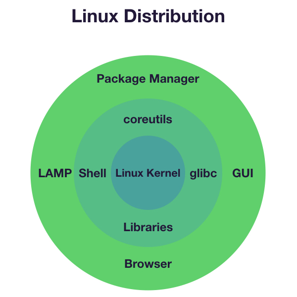
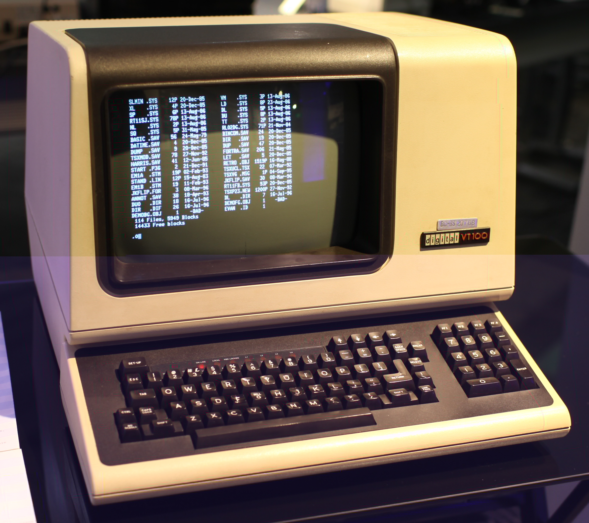

# Linux 101

    Course Code: ELEE1119

    Course Name: Advanced Computer Engineering

    Credits: 30

    Module Leader: Seb Blair BEng(H) PGCAP MIET MIHEEM FHEA

---

## Introduction

What to expect: 

   - We'll talk lots about Linux and how other operating systems suck
   - We'll address why you might think Linux sucks
   - We'll try to make Linux suck less for you

---

## Introducing, the BDFL (Benevolent Dictator For Life)

**Linus Torvalds** started this whole thing as a personal project in the early 90s, while he was a student at the University of Helsinki in Finland.

Since then, the Linux kernel has grown to become the largest known open-source project in the world, with individuals and commercial entities contributing, world-wide.

---
## Linux Distributions
What's a Linux distribution? To keep it simple for now:

 - Referring to any Linux-based operating system simply as 'Linux' or 'GNU\Linux' is common Linux + GNU

- Software all wrapped up nicely into a complete operating system is known as a `Linux distribution', e.g., Ubuntu, Fedora, CentOS, ...

---

## A Whole World of Choice

<!--- 
- People form communities around ideas and requirement
- Linux distributions are a reflection of that 
- Communities of people have created different Linux distributions to satisfy their requirements or ideas
- This also means that some distributions are easier and others harder to install and use-->
---

## List Some Operating Systems

Answers

- GNU/Linux
- Microsoft Windows
- Apple macOS
- freeBSD/openBSD/netBSD

--- 

## Windows

---

## Windows - Strengths and Weaknesses

<table align=center>
<tr>
<td>

 **Pros**                           
- Ubiquitous on the Desktop                       
- Much used in Enterprise                         
- Lots of software written for it                 
- Familiarity with the UI(User Interface)
- Games                                           
- Comes pre-installed

</td>
<td>

**Cons**

- Modification is hard
- Licensing fees
- Updates are horrible
- Loved by bad actors
- Not very flexible
- Privacy issues

</td>
</tr>
</table>

---

## freeBSD/openBSD/netBSD

  

---
## freeBSD/openBSD/netBSD - Stengths and Weaknesses

<table align=center>
<tr>
<td>

**Pros**  

- Comparatively small       
- Very liberal licensing    
- No licensing fees         
- Could run your toaster    
- Base of PlayStation 4's OS
- Tight development         
- Quite secure (openBSD)    
- Versatile                 

</td>

<td>

**Cons**

- Hardware support  
- Not as widespread 
- Package management difficult 
- Steep learning curve 
- Smaller software collection 
- Installation is challenging
- ~
- ~
</td>
</tr>
</table>

---

## macOS

---

## macOS — Strengths and Weaknesses

<table align=center>
<tr>
<td>

**Pros**  

- Looks good (debatable)                   
- Good usability                           
- Great when you live in Apple's ecosystem & 
  Not Enterprise ready (realistically)
- Good specialist software support        
- Pretty stable                           

</td>
<td>

**Cons**

- Tightly tied to Apple HW 
- Apple's ecosystem 
- Possible privacy issues
- ~
- ~
- ~
</td>
</tr>
</table>

---

## GNU/Linux

 

---

## GNU/Linux - Strengths and Weaknessess

<table align=center>
<tr>
<td>

**Pros**  

- Easy to install
- Much used in Enterprise                   
- Lots of software written for it           
- Can customise it to your liking           
- Huge community support                    
- Excellent package management              
- No licensing fees                         
- Updates are fast and efficient            
- Versatile                                 

</td>

<td>

**Cons**

- Relatively steep learning curve 
- Printer support is a bit meh 
- Games (getting better now)
- Too much choice (?)
- Not normally pre-installed
- ~
- ~
- ~
- ~
</td>
</table>

---

# Software/Pacakge Manager

---

## Software Management?

- Open web-browser
- Search Google for the software you want
- Click on an excellent ~~dodgy~~ legit link
- (optional) click through many more links until you finally download software
- Wait for Windows to declare that your download is malware-free
- Launch the downloaded installer package
- Click your way through the installation and ~~don't~~ pay attention to the options or EULA (End-User License Agreement)
- ???
- Profit?

---

## Software Management? (Cont'd)

 Everything is fine with the software, but how do you update it? Well...

- (**Good**) The software might have its own update mechanism (e.g., Google Chrome) and does it pretty much automatically
- (**Bad**) The software might have no update mechanism at all, and you need to keep an update-check schedule in your head
- (**Ugly**) The software might nag you that an update is available, and it's up to you to download and install it

---

## Software Management? (Cont'd)

This is an inherent problem with the Windows ecosystem. The most obvious problems with outdated software are security related. Microsoft has tried to address this by introducing **Windows Store**. 

However, uptake is just not that good because most people are used to installing the tedious way (see previous slides), and also a lot of software isn't available in their store.

Though, Microsoft have picked up now with the development of their own CLI-based package manager, called **winget**

---

## Package Management

Pretty much all Linux-based operating systems (distributions) have a package management system. What's a package manager?

- As a one-stop-shop for all your software needs, a package manager...

- ... finds software you're looking for from a centralised index,

- ... installs software from a centralised, vetted, repository,

- ... updates everything (including core components like the Linux kernel) because it knows what you've installed, and finally

- .... removes\uninstalls software cleanly for you.

---

# FLOSS Model

---

## What's FLOSS?

**F**ree/**L**ibre **O**pen-**S**ource **S**oftware

We don't have enough time to go through the inherent philosophy of FLOSS software, under which Linux and most software in this realm falls under. Suffice to say, it's revolutionised nearly every aspect of modern life since the internet was invented. This 90 minute documentary is worth watching to give you an understanding of how things got started: https://www.youtube.com/watch?v=J1bBG1NtL18

---

# Basic Architecture 

---

## Separation of Worlds

Windows is the best example of an operating system that has **user space** and **kernel space** well fused together. Linux and some others don't do this, which brings a number of advantages:

- the kernel doesn't care about the upper layers, so you can run (pretty much) whatever you want on top
- nearly any system component (daemon, drivers, ...) can be replaced
- it's easier to figure out the root cause of an issue

---

# Basic Shell Commands

---

## The Terminal

... is your friend. No, seriously.

---

## But Why???
You might think this is a pretty archaic way of interacting with a system, however...

- a terminal allows you to express yourself, which is not something you can do in a **WIMP** (Windows, Icons, Menus and Pointer) **GUI** (Graphical User Interface)
- you have to put effort into learning the grammar and syntax, but...
- your power-levels will increase way over 9000!!!

---

## The Command Line\Shell

The words **command line**, **shell**, and **terminal** are often used interchangably, but that's not quite correct. Let's try to set things right:
- **Command line** --- An interface for typing commands directly to a computer's operating system
- **Terminal** --- A device at which a user enters data or commands for a computer system and which displays the received output
- **Shell** --- A program which provides an interface between the user and the operating system

---

## The Command Line\Shell (cont'd)
    
A **terminal**used to be a physical monitor and keyboard that was attached to a big computer (i.e., Mainframe).

 

*A DEC VT100 Terminal*

 

Nowadays, a terminal is a piece of software that gives you access to a **shell** program, which represents a **command line** interface for you to communicate with the operating system in an expressive fashion.

---

## The Command Line\Shell (cont'd)

So, to recap:

- A **Terminal** is a piece of software that gives you access to...
- a **Shell**, which is a piece of software that interprets commands. Both together provide you with...
- a **Command Line** interface to type your commands in and communicate with the operating system.

---

## Basic Shell Commands

These are just a few of the most common commands you'll learn to appreciate as you become more familiar with CLI-driven environments.

<table align=center>
<tr>
<td align=right>

List directory contents            
Copy files and folders             
Move or rename files and folders   
Concatenate the contents of a file 
View the manual for a command      
View the contents of a text file   
</td>

<td>

`ls` (**l**i**s**t)
`cp` (**c**o**p**y)
`mv` (**m**o**v**e)
`cat` (con**cat**enate) 
`man` (**man**ual)
`less`

</td>
</tr>
</table>

*We'll see the use of these commands and moment...*

---

## Distribution Test...

If you would like to test different Linux distributions, but don't want to bother trying them on your hardware, you can always use https://distrotest.net/ to test a vast majority of Linux distributions. It's easy and free and runs in your browser.

If there's time left in this session, go to the above website and test a distribution.

---

## Why is this important at UoG?
There are many reasons why we use Linux in teaching and research, it's...
- ... **educational**, just by using it, you can learn so much
- ... **open (libre)**, anyone can have a look at how it works, and change it to suit them better
- ... ***free (as in free beer)**, which makes using a copy of your favourite distribution easy
- ... **used in industry** for all sorts of reasons, from high-reliability infrastructure to space vehicles (e.g., Mars Helicopter), to supercomputers, to cars, to fridges and other IoT (Internet of Things) devices
- ... **hidden**, and forms the basis of so much technology you use every day; you should learn how to engage with it