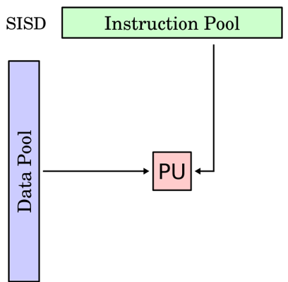
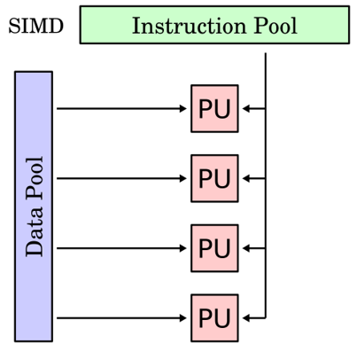
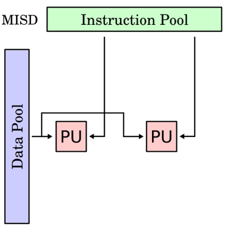

# Multitasking and Daemons

    Course Code: ELEE1119 
    
    Course Name: Advanced Computer Engineering

    Credits: 30

    Module Leader: Seb Blair BEng(H) PGCAP MIET MIHEEM FHEA

---

## Flynn's Taxonomy

- Flynn's taxonomy is a classification of computer architectures, proposed by Michael J. Flynn in 1966. ​

- The classification system has stuck, and it has been used as a tool in design of modern processors and their functionalities. ​

- Since the rise of multiprocessing CPUs, a multiprogramming context has evolved as an extension of the classification system.​

- SISD,  SIMD,  MISD,  MIMD​

---

## Flynn's Taxononmy SISD

**Single instruction stream, single data stream (SISD)​**

- A sequential computer which exploits no parallelism in either the instruction or data streams. ​

- Single CU fetches single instruction stream (IS) from memory. ​

- The CU then generates appropriate control signals to direct single processing element (PE) to operate on single data stream (DS) i.e., one operation at a time​
​

---

##  Flynn's Taxonomy SIMD

**Single instruction stream, multiple data streams (SIMD)​**

- A single instruction operates on multiple different data streams. ​

- Instructions can be executed sequentially, such as by ​
pipelining, or in parallel by multiple functional units.​

​

---

## Flynn's Taxonomy MISD

**Multiple instruction streams, single data stream (MISD)​**

- Multiple instructions operate on one data stream. ​

- This is an uncommon architecture which is generally used for fault tolerance.​

- **Heterogeneous** systems operate on the same data stream and must agree on the result. ​

- Examples include the Space Shuttle flight control computer​

---

## Flynn's Taxonomy MIMD

**Multiple instruction streams, multiple data streams (MIMD)​**

- Multiple autonomous processors simultaneously executing ​different instructions on different data. ​

- MIMD architectures include multi-core superscalar ​processors, and distributed systems, using either one shared ​memory space or a distributed memory space​

- As of 2006, all the top 10 and most of the TOP500​supercomputers are based on a MIMD architecture​
​

---

## Multitasking 

- Concurrent execution of multiple tasks (processes) over a certain period. ​

- Execution of **segments** of multiple tasks in an **interleaved** manner, while the tasks share common processing resources such as CPUs, GPUs, FPUs, VPUs and RAM​

- New processes or tasks can interrupt running processes or tasks before they finish. ​

- **Switch context** is the mechanism that interrupts can Save and load states – partial results, memory content and computer registers content. ​

- Real time systems, Multithreading, memory protection, memory swapping and programming​

---

## Multitasking Pt2

- Execute more than one tasks at the same time.​

- In multitasking only one CPU is involved but it can switches from one program to another program so quickly that's why it gives the appearance of executing all of the programs at the same time. ​

- Multitasking allow processes (i.e. programs) to run concurrently on the program. For Example running the spreadsheet program and you are working with word processor also.​

- Multitasking is running heavyweight processes by a single OS​​

---

## Multithreading

- Running multiple **lightweight** processes in a single process/ task or program. ​

- For Example, When you used a word processor you performs a many different tasks such as printing, formatting text, spell checking and so on​

- Multithreaded software treats each process as a separate program.​

---

## Multithreading vs Multitasking

**Some advantages of multithreading over multitasking are** :​
​
- Threads share the same address space.​

- Context switching between threads is usually less expensive than between processes.​

- Cost of communication between threads is relatively low.​

---

## Parallelism

- **Parallel computing** is a type of computation where many calculations or the execution of processes are carried out simultaneously.​

- Large problems can often be divided into smaller ones, which can then be solved at the same time​

So what are the laws that govern parallel computing?​

---

## Amdahl's Law

Amdahl’s law is the performance improvement of a system with the parts that didn’t perform well.​

$$
\begin{align*}
    S_{max} = \frac{1}{(1-p) + \frac{p}{s}}
\end{align*}
$$
​
$S_{max}$ is the maximum possible improvement of the system

$p$ is the part that can be improved

$\therefore$ 

$(1\ -\ p)$ is the part of the system that can't be improved

$\frac{p}{s}$ is the performance improvement factor of $p$ after applying the enhancements.

---

## Amdahl's Law Example

Let us now look at how the maximum improvement can be calculated using Amdahl's law. For a given system, if the part that can be improved is 25\% of the overall system and its performance can be doubled, then:

Let us now suppose that for a different system, the part that can be improved is 75\% of the overall system and its performance can be doubled, then:​

<!--
$$
\begin{align*}
    1.14 = \frac{1}{(1 - 0.25)+\frac{0.25}{2}}
\end{align*}
$$​

$$
\begin{align*}
    1.6 = \frac{1}{(1 - 0.75)+\frac{0.75}{2}}
\end{align*}
$$
-->
---

## Amdahl's Law Example Pt2

Comparing the two values, we can see that the more important the part that cannot be improved, the less the benefit of the improvement.​

Note, that if the whole system can benefit from the improvement, Smax will have a value of 2, which is the maximum possible performance improvement.​

Now do it so that Smax can have a maximum value 4….​

---

## Graphin Amdahl's Law

- The speedup of a program from parallelization is limited by how much of the program can be parallelised. ​
​

- For example, if 90% of the program can be parallelized, the theoretical maximum speedup using parallel computing would be 10 times no matter how many processors are used​

---

## Gustafson's Law

Gustafson’s Law gives the theoretical speedup in latency of the execution of a task at fixed execution time that can be expected of a system whose resources are improved.​

$$
    \begin{equation*}
       S_{latency} = 1 - p + sp 
    \end{equation*}
$$

$S_{latency}$ is the theoretical speedup in latency of the execution of the whole task.

$s$ is the speeedup in latency of the execution of the part of the task that benefits from the improvement of the the resources of the system.

$p$ is the percentage of th execution workload of the whole task concerning the part that benefits from the improvement of the resources of the system before the improvement.

---

## Graphing Gustafson's Law

Evolution according to Gustafson’s Law of the theoretical speedup in ​latency of the execution of a program ​as a function of the number of ​
processors executing it, for different ​values of p.​

---

## Daemons

So what are Daemons?​

 - In ancient Greek belief a divinity or supernatural being of a nature between gods and humans.​

- An inner or attendant spirit or inspiring force.​

Or ​

- A background process that handles requests for services such as print spooling and file transfers, and is dormant when not required​

Origin​

- 1970s: perhaps from d(isk) a(nd) e(xecution) mon(itor) or from de(vice) mon(itor).​

---

## Daemons

- In multitasking computer operating systems, a daemon is a computer program that runs as a background process, rather than being under the direct control of an interactive user.​

- Traditionally, the process names of a daemon end with the letter **d**, for clarification that the process is in fact a daemon, and for differentiation between a daemon and a normal computer program. ​

- For example, syslogd is a daemon that implements system logging facility, and sshd is a daemon that serves incoming SSH connections​

- Systems often start daemons at boot time that will respond to network requests, hardware activity, or other programs by performing some task. ​

- Daemons such as **cron** may also perform defined tasks at scheduled times​
​

---

## Basic Structure of Daemons

- Fork off the parent process. ​

- Change file mode mask (umask) ​

- Open any logs for writing. ​

- Create a unique Session ID (SID) ​

- Change the current working directory to a safe place. ​

- Close standard file descriptors. ​

- Enter actual daemon code.​

---

## Difference between Daemons and a Processes

- Daemon’s parent is init – the first process started during *Nix booting. ​

- that is why a Daemon is not connected to a terminal. So when you close ​
your terminal it will not be killed by OS. ​

- But still you can send signals to your Daemon​

---
​
## So how do you stop a Deamon process in Linux?

- Use `kill -9` to kill the process. ​

- With a signal number of 9 (KILL), the kill cannot be caught by the process; use this to kill a process that a plain kill doesn’t terminate.   ​

- Becareful, because the process will not shutdown safetly and therefore could cause undesired affects on your systems.​

- Sends the `SIGKILL` signal to kill the process which is the strongest signal of all​

---

## List all Daemons currently running

`systemctl | grep daemon`

[+]: the service is running

[-]: the service is not running

[?]: the service state cannont be determined 

---

## Daemons must have

All daemon scripts must have a…​

- `setupDaemon()`  - setup all directories, create or check​
- `startDaemon()` - starts the daemon process – usually calls `setupDaemon()` and `loop()​`
- `stopDaemon()`  - stops the daemon and all its processes​
- `restartDaemon()` - stops and starts the daemon with the same process ID​
- `statusDaemon()` – queries and returns whether the daemon is running (user)​
- `checkDaemon()` – like statusDaemon, but used by the daemon directly​
- `doCommands()` – this is where you specify the commands/scripts that the daemon will run​
- `loop()` – runs the specified commands/scripts in a loop at specified intervals… while the daemon is running. ​