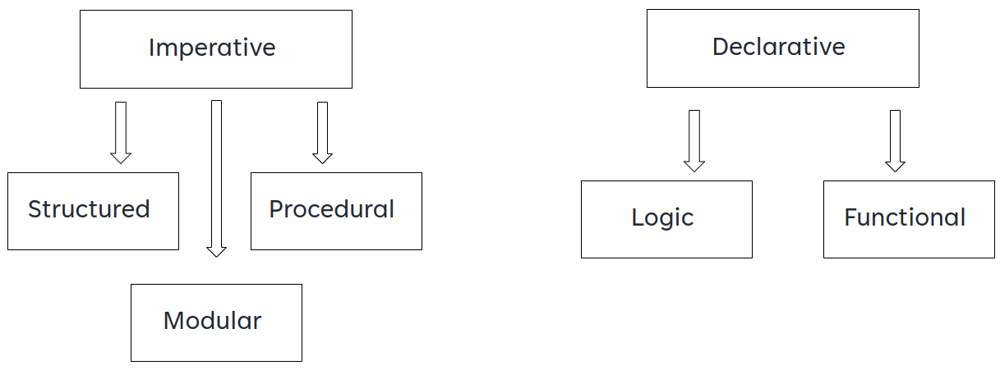
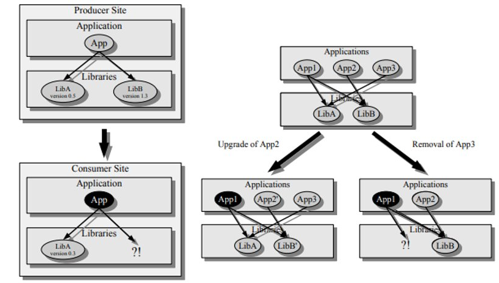
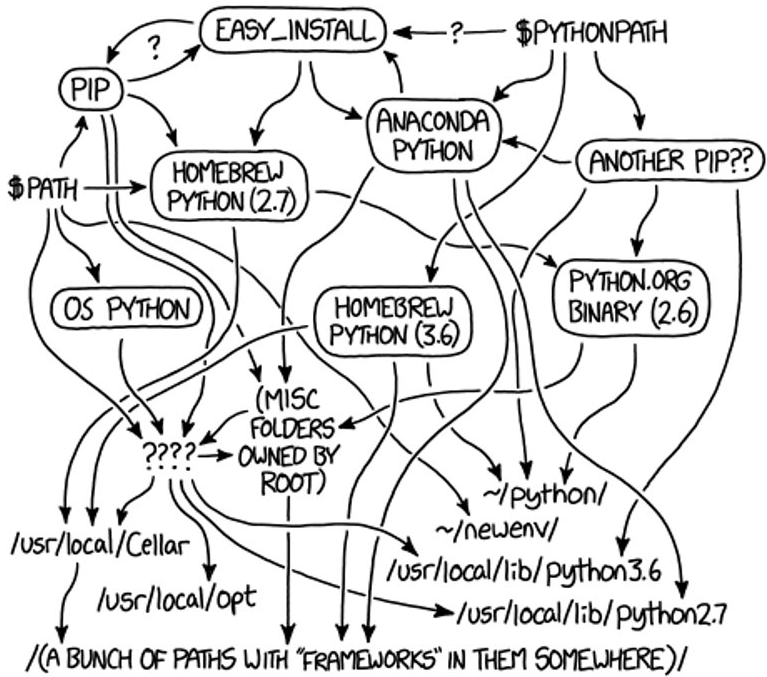

# Operating System Types

    Course Code: ELEE1119 
    
    Course Name: Advanced Computer Engineering

    Credits: 30

    Module Leader: Seb Blair BEng(H) PGCAP MIET MIHEEM FHEA
---

## Types of OS


---

## Batch OS

**Batch** - because batch system is very useful for calculating the salaries of all employees in the end of month​
​
**Bank Invoice System** - produce all monthly statements of all bank’s clients​
​
**Transactions Process** - mostly implement the international money transfers system.​
​
**Daily Report** - manufacturer industries, every day need operational statement for production line​

---

## Multi-tasking/Time-sharing Operaing Systems

Time-sharing operating system enables people located at a different terminal(shell) to use a single computer system at the same time. ​

The processor time (CPU) which is shared among multiple users is termed as time sharing.​

**Adv​​**
- It provides the advantage of quick response.​​
- This type of operating system avoids duplication of software.​​
- It reduces CPU idle time.​​

**DisAdv​​**
- Time sharing has problem of reliability.​​
- Question of security and integrity of user programs and data can be raised.​​
- Problem of data communication occurs.​

---

## Real Time OS

A real time operating system time interval to process and respond to inputs is very small. Examples: Military Software Systems, Space Software Systems are the Real time OS example.​

**Soft Real Time OS​**

- A Soft RTOS is a system in which the deadline for certain tasks can be delayed to some extent. For example, if the task deadline is 1:20:30PM, then the task can on occasions complete at let us say 1:20:35PM every. However, it can not delay for too long say 1:30PM.​

**Hard Real Time OS​**

- A Hard RTOS is a system which meets the deadline for every process at all times. For example, if the task deadline is 1:20:30PM, then the task has to complete before 1:20:30PM every time.​

---

## RTOS 2

**VxWorks**: This OS is part of the Mars 2020 rover. ​

**QNX**:  it is compatible with platforms like ARM and x86. Industries using QNX are automotive, railway transportation and health-care.​

**eCos**: is an open-source real-time operating system.

**RTLinux**: is a hard RTOS. It runs the Linux operating system as a full preemptive process. As a result, it is useful in controlling robots, data acquisition systems, manufacturing plants.​


<!--
VX  Also, in the past, it was used in Phoneix Mars lander, Boeing 787, Honda Robot ASIMO etc.

eCOS Used for Chibis-M microsatellite‘s altitude and stabilization control system.
-->

---

## Distributed OS

Distributed systems use many processors located in different machines to provide very fast computation to its users.​

A DOS is a system which contains multiple components located on different machines, which coordinate and communicate actions in order to appear as a single coherent working system to the user.​

---

## Network OS

Network Operating System runs on a server. It provides the capability to serve to manage data, user, groups, security, application, and other networking functions. ​

Includes software and associated protocols to communicate with other autonomous computers via a network conveniently and cost-effectively​

It allows devices like a disk, printers, etc., shared between computers. The individual machines that are part of the Network have their operating system.​


---

## Mobile OS

- Mobile operating systems are those OS which is especially that are designed to power smartphones, tablets, and wearables devices.​

- Some most famous mobile operating systems are Android and iOS, but others include BlackBerry, Web, and watchOS.​

---

## OS - Market Share

​

---

## Linux Distros


---

## OS Configuration

Comes in two paradigms, imperative (nomarl) and declarative (abnormal)


---

## Programming & Configuation Paradigms




---

## Real World Example


**Declarative real world example:**

1. Librarian, please check me out a copy of ‘programming paradigms’. (Librarian, at their discretion chooses the best method for performing the request).

**Imperative real world example:​**

1. Go into library​
2. Find book organisation system (card catalogue - old school)​
3. Research how to use card catalogues (you forgot too, right)​
4. Figure out how shelves are labelled and organised.​
5. Figure out how books are organised on a shelf.​
6. Cross-reference book location from card catalogue with organisation system to find said book.​
7. Take book to check-out system.​
8. Check out book.​


---

## Comparison of Programming Paradigms: Imperative and Declarative Programming

|Imperative |Declarative |
|---|---|
|"How?"|"What?"|
|Classic|New trend|
|A program based on this paradigm is made up of a series of instructions that tell the computer what it should calculate/do and in what order.|A program based on this paradigm is made up of instructions for how the program should deal with an input. Calculations are performed by manipulation of values, with the procedure controlled by the process of recursion.​|
|The name comes from “imperare”, the Latin word for “command”.|The name comes from “declarare”, the Latin word for “describe”.​|
|The desired solution path is specified|The desired result is specified.​|
|Typical programming languages include C, Pascal, Fortran, ALGOL, and all assembly languages.|Typical programming languages include Lisp, ML, Haskell, F#, Prolog, and Oz​|

---

## Imperative

… is a paradigm of computer programming where the program describes steps that change the state of the computer.

```js
const passwords = [ "123456", "password", "admin", "UniveristyofLife", "mypassword123"]; 
```

```js
// using the passwords constant from above let longPasswords = []; ​
for (let i = 0; i < passwords.length; i++) { ​
    const password = passwords[i]; ​
    if (password.length >= 9) ​
    { ​
        longPasswords.push(password);​
    }​
} ​
console.log(longPasswords); // logs ["UniversityofLife", "mypassword123"]; ​
```

---

## Declarative

…which describes "what" a program should accomplish​

So instead of giving the computer step by step instructions, we declare what it is we want and we assign this to the result of some process.​

One of declarative programming’s strengths is that it forces us to ask what we want first. It is in the naming of these new things that our code becomes expressive and explicit.​

```js
const passwords = [ "123456", "password", "admin", "UniveristyofLife", "mypassword123"]; 
```

```js
// using the passwords constant from above ​
const longPasswords = passwords.filter(password => password.length >= 9); ​
console.log(longPasswords); // logs ["UniversityofLife", "mypassword123"]; ​
```

---

## Which is Declarative or Imperative (C#)?

```csharp
List<int> collection = new List<int> { 1, 2, 3, 4, 5 }; ​
```
==================================================================
```csharp
 List<int> results = new List<int>(); ​​

 foreach(var num in collection)​​
 { ​​
    if (num % 2 != 0) ​​
    {​​
        results.Add(num); ​​
    }​​
 } ​
```
:::::::::::::::::::::::::::::::::::::::::::::::::::::::::::::::::::::::::::::::::::::::::::::::::::::::::::::::::::::::::::::::::::::::::::

```csharp
var results = collection.Where( num => num % 2 != 0);​​
```
---

## Which is Declarative or Imperative (Python)?
==================================================================
```py
small_nums = [ ] ​​

for i in range(20): ​​
        if i < 5:​​
            small_nums.append(i) ​​
```
:::::::::::::::::::::::::::::::::::::::::::::::::::::::::::::::::::::::::::::::::::::::::::::::::::::::::::::::::::::::::::::::::::::::::::
```py
small_nums = [x for x in range(20) if x < 5] ​​
```

---

## Consider the Docker file for Debian Build

- You start from an existing image​
- You declare how to change it​

```dockerfile
FROM debian:jessie​

RUN apt-get update \ ​

&& apt-get install –no-install-recommends –y  \​

openjdk-7-kdk​
```
This is fine, but:​
- You declare **how** to build an image not **what** the image you want to build​
- This is too linear (layers of cache)​
- It’s hard to compose- You get a new image

---

## Mutable vs Immutable Flow


---

## Consider NixOS Configuration

```nixos
{ config, lib, pkgs, ... }:​
{​
  boot.loader.grub.device = "/dev/nvme0n1p1";​
  fileSystems."/".device = "/dev/nvme0n1p2";​
  networking.firewall = {​
    enable = true;​
    allowedTCPPorts = [ 80 ];​
  };​

  environment.systemPackages = with pkgs; [​
    wget
    git​
    lolcatz​
  ];​
}​
```
The form {x, y, ..., z}: e where x, y, etc. are the names of the expected arguments, and where e is the body (result) of the function.


---

## Dependency Hell

**Many** - Application depends on many libraries, requiring lengthy downloads, large amounts of disk space, and being very portable (all libraries are already ported enabling the application itself to be ported easily)​


**Long Chains** - If `app` depends on `liba`, which depends on `libb`, ..., which depends on `libz`. These long chains of dependencies can be solved by having a package manager that resolves all dependencies automatically​

---

## Dependency Hell

**Conflicting** - If `app1` depends on `libfoo 1.2`, and app2 depends on `libfoo 1.3`, and different versions of `libfoo` cannot be simultaneously installed, then `app1` and `app2` cannot simultaneously be used (or installed, if the installer checks dependencies)​

**Circular** - If `application A` depends upon and can't run without a specific version of `application B`, but `application B`, in turn, depends upon and can't run without a specific version of `application A`, then upgrading any application will break another

---

## Atomic vs Non-Atomic



---

## Mozilla Firefox Runtime Dependency Hell


​

---

## PIP Dependency Hell


Even with state-of-the-art best practices, you can still end up in Dependency Hell when adding new dependencies, because there is an issue for pip first reported in 2013 to implement dependency resolution and was only partially resolved in 2020.​



---


## Atomic and Immutable Deployment

- **Atomic deployment** – Make updates available only when they are complete and totally in place. ​
  - NixOS -> if the upgrade to a new configuration is interrupted — say, the power fails half-way through — the system will still be in a consistent state: it will either boot in the old or the new configuration.​

- **Immutable deployment** – Guarantee the integrity of previous deploys by insulating them from future actions.​
  - A “mutable OS ” can change (be mutated) over time, an “immutable OS” the root directory cannot be changed, it has a read-only structure. Every package installed on the system creates a layer that runs isolated from the root directory​

---

## Arch LiNUX - Keep It Simple Stupid

The Arch attempts to have minimal distribution-specific changes, and therefore minimal breakage with updates, and be pragmatic over ideological design choices and focus on customizability rather than user-friendliness.​

The main focus involves creating an environment that is straightforward and relatively easy for the user to understand directly, rather than providing polished point-and-click style management tools — the package manager, terminal only!​

Relying on complex tools to manage and build your system is going to hurt the end-users. [...] "If you try to hide the complexity of the system, you'll end up with a more complex system". Layers of abstraction that serve to hide internals are never a good thing. Instead, the internals should be designed in a way such that they NEED no hiding.​  (https://bugs.archlinux.org/task/43302)​

---

## Installation Configuration

```sh
{
    "audio": null,
    "bootloader": "grub-insall",
    "desktop-environment": "kde",
    "dry-run": false,
    "gfx-driver": "All open-source (default)",
    "harddrives": [
        "/dev/sda"
    ],
    "hostname": "admin",
    "kernels": [
        "liux"
    ],
    "keyboard-layout": "uk",
    "mirror-region": {},
    "nic": {
        "NetworkManager":true,
        "nic": "Use NetworkManager (necessary to configure internet graphically in GNOME and KDE)"
    },
    "ntp": true,
    "packages": [
        "chromium"
        "firefox"
    ],
    ...
}
```