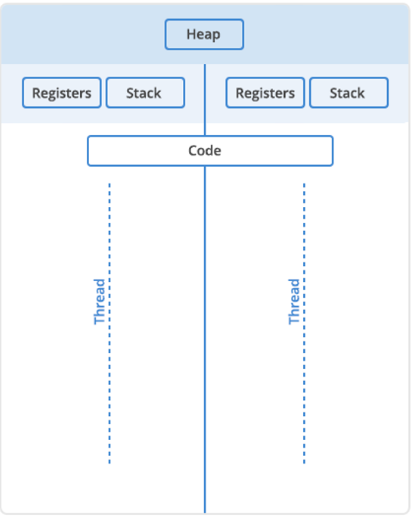
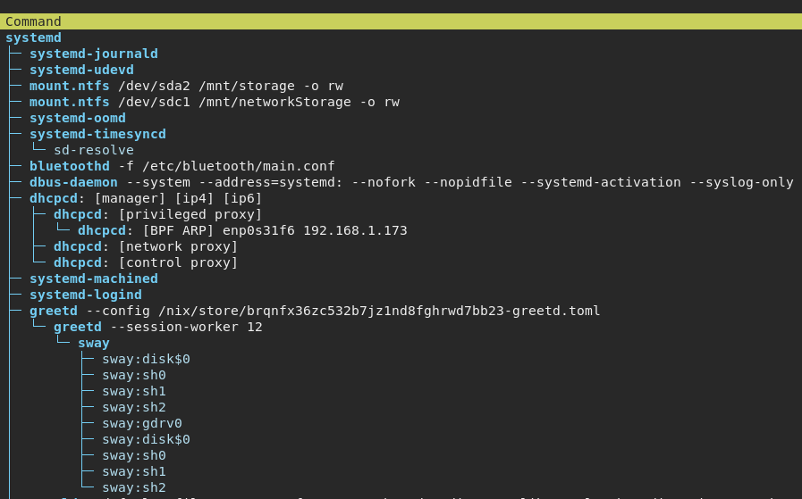

# Programs, Processes and Threads

    Course Code: ELEE1119 
    
    Course Name: Advanced Computer Engineering

    Credits: 30

    Module Leader: Seb Blair BEng(H) PGCAP MIET MIHEEM FHEA
    
---

## Programs

- Code that is stored on a computer that can complete a certain task
- Can be built into the operating system
- Can be specific task
  - AKA *applications*
- Typically stored on a disk or in *nonvolatile* memory in executable format. Let’s break that down to understand why.

--- 

## Programs - Memory

 - **Volatile** 
   - Is temporary and processes in real time. 
   - It’s faster, easily accessible, and increases the efficiency of the computer.
   - Not permanent. When your computer turns off, this type of memory resets.
 - **Non-Volatile**
   - Is permanent unless deleted. 
   - It’s slower to access, it can store more information. So, that makes it a better place to store programs.

- A **file** in an executable format is simply one that runs a program. It can be run directly by your CPU (that’s your processor). 
     - Examples of these file types are .EXE in Windows and .APP in Mac.

---

## Programs - Compiled

- Most programs are written in a **compiled** language (processed by the compiler)
  - C, C++, C#,Java, Python, Rust, ... etc
- The end result is a text file of code that is compiled into binary form
- The text file *speaks* directly to your computer. 
- They’re typically fast, 
- More control over things like memory management
- They are also fixed compared to **interpreted** programs. 
- *Platform dependent *
- If you have to change something in your code, it typically takes longer to build and test.

---

## Programs - Interpreted
- Some of the most common interpreted programming languages (executed from source code form, by an interpreter)
  - Basic, JavaScript, PHP, Ruby... etc.
  - BASH, Powershell (inclduing scripting languages)
- Require an additional program to take the program instructions and translate that to code for the computer. 
- Compared with **compiled** languages, these types of programs are *platform-independent* ( just have to find a different interpreter, instead of writing a whole new program) 
- Typically take up less space.

---

## Programs - Execution

- Programs have to run in binary because your computer’s central processing unit (CPU) understands only binary instructions.
- Needs to be loaded into memory:
  - The executing program needs resources from the operating system and memory to run.
  -  When a program is loaded into memory along with all the resources it needs to operate, it is called a **process**

---

## Process - Essential Resources

- **Register** contains data that may be needed by a process like instructions, storage addresses, or other data.

- **Program counter** Also known as an instruction pointerIt keeps track of where a computer is in its program sequence.

- **Stack**. A stack is a data structure that stores information about the active *subroutines* of a computer program. It is used as scratch space for the process. It is distinguished from *dynamically* allocated memory for the process that is known as the **heap**.

---

## Process - State

---

## Process Control Block (PCB)
- **Process state**
- **Program counter**
- **CPU registers**
- **CPU-scheduling information**
- **Memory-management information**
- **Accounting information**
- **I/O status information**

 
 <!--
 - Process state. Storing the current state of the process.

- Program counter. Address of next instruction.

- CPU registers. Index registers, stack pointers, and general-purpose registers, state information for correct process state change.
- CPU-scheduling information. Process priority and scheduling information. 
- Memory-management information. Page tables, or the segment tables etc. 

- Accounting information. This information includes the amount of CPU and real time used, time limits, account numbers, job or process numbers, and so on.
- 
- I/O status information. List of I/O devices allocated to the process, a list of open files, and so on.
 -->

---

## Process - Instances
- Multiple instances of a single program
  - Multiple processes one for each program
  - Seperate memory address space
    - Independent
    - Isolated

- `Kill` a malfunctioning program and keep working with minimal disruptions

---

## Threads - ?

- Unit of execution within a process.
- Process can have 1:n threads

---

## Thread - Single

- Process starts
  - Receives an assignment of memory and other computing resources. 
  -  Each thread in the process shares that memory and resources.
  -  With single-threaded processes, the process contains one thread.

---

## Thread - Multi

  Process contains more than one thread, 
- Process is accomplishing a number of things at the *virtually* same time (**concurrency**).
- Each thread will have its own **stack**. 
- All the threads in a process will share the **heap**.
- It is easy to communicate between the threads. 
- One **malfunctioning** thread in a process can impact the viability of the process itself.

---

## Process and Threads Flow

Here’s what happens when you open an application on your computer...

---

## Interprocess Communication (IPC)

- **(a) Shared Memory**
  - Processes exchange information by writing and reading in the shared memory

- **(b) Message passing**
  - Processes exchange information via a messaging system

---

## Program, Process, Thread

Using HTOP to see systemd (System Daemon)

---

## Concurrency and Parallelism

Can processes or threads can run at the same time?

It depends.

- Multiple processors or CPU cores multiple processes or threads can be executed in parallel. 
- On a single processor, though, it is not possible to have processes or threads truly executing at the same time. 
  - CPU is shared among running processes or threads using a process scheduling algorithm that divides the CPU’s time and yields the illusion of parallel execution. 
  - The time given to each task is called a “time slice.” 
  - Context switching back and forth between tasks happens so fast it is usually not perceptible.

--- 

## Concurreny and Parallelsim

- **Parallelism** 
  - genuine simultaneous execution 

- **Concurrency** 
    - interleaving of processes in time to give the appearance of simultaneous execution  

