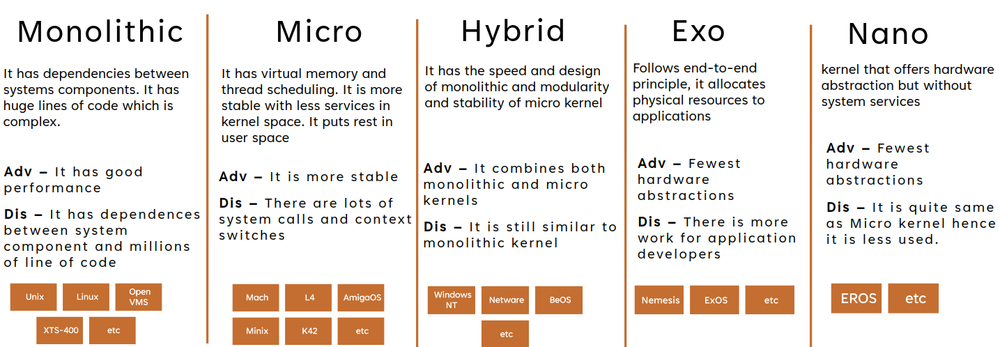
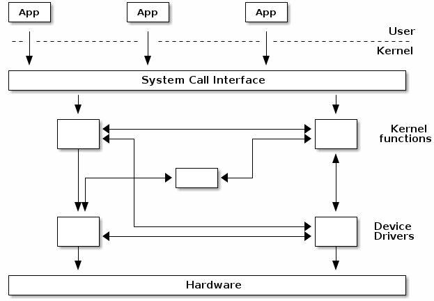
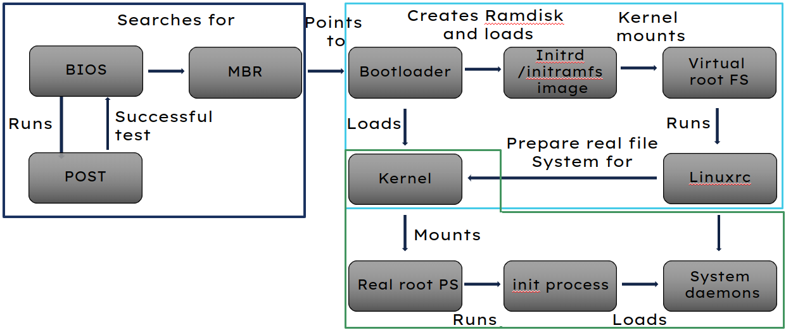
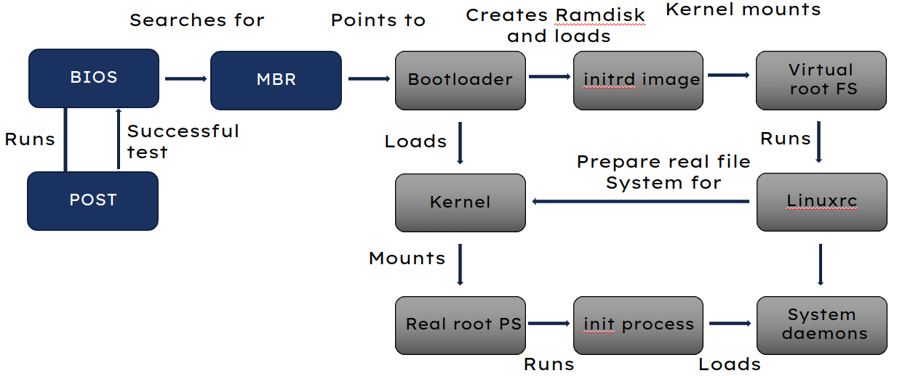
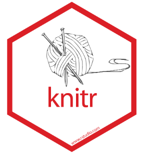
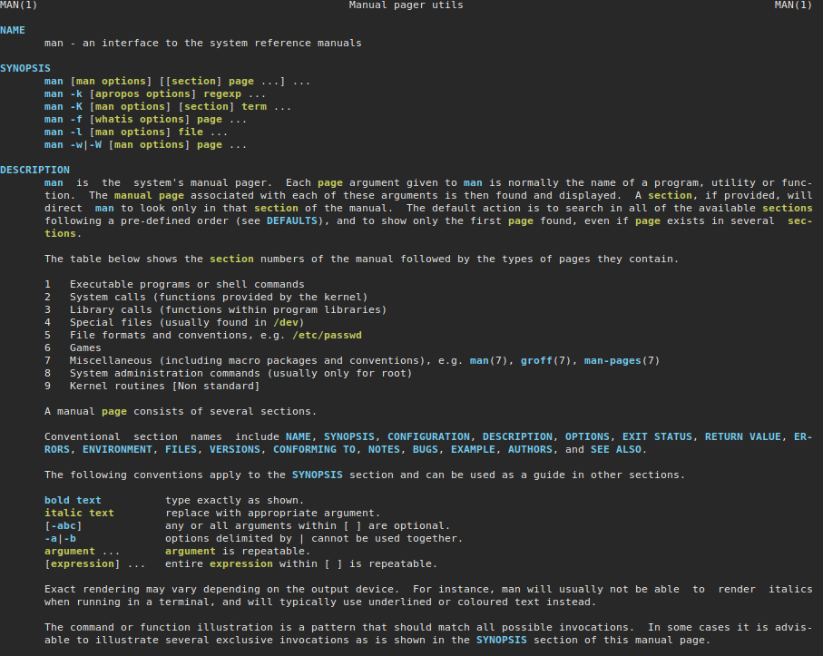

# Revision

    Course Code: ELEE1119 
    
    Course Name: Advanced Computer Engineering

    Credits: 30

    Module Leader: Seb Blair BEng(H) PGCAP MIET MIHEEM FHEA

---

## Key Topics

- Compiler Stages
- Basic summing functions in assembley 
- Kernels
- Booting Process 
- Shell programming
- Version control
- man pages

---

## Compiling Code


---

## Intermediate Code Generation

Removes unnecessary code lines​.

Arranges the sequence of statements to speed up the execution of the program without wasting resources. ​

Consider the following code, how can we remove unnecessary code? ​

```c
a = int_to_float(10)​
b = c * a​
d = e + b​
f = d​
```

<details>
<summary>Can become</summary> 

```c
b = c * 10.0​
f = e+b​
```
</details>

---

```c
int square(int num) {​
    return num * num;​
}
```
```as
square:​
  pushq  %rbp​
  movq   %rsp, %rbp​
  movl   %edi, -4(%rbp)​
  movl   -4(%rbp), %eax​
  imull  %eax, %eax​
  popq   %rbp​
  ret​
```

---

## Assembley 
<div style="font-size:22px" >

- `rbp`
  - is the frame pointer on x86_64. In your generated code, it gets a snapshot of the stack pointer (`rsp`) so that when adjustments are made to `rsp` (i.e. reserving space for local variables or pushing values on to the stack), local variables and function parameters are still accessible from a constant offset from `rbp`.
- `mov`  Move source to destination
- `edi` copy incoming data
- `eax` take the lower 32-bits of the 64bit value 
- `push` Decrements the stack pointer and then stores the source operand on the top of the stack.Push source onto stack
- `pop`  Pop top of stack into destination 
- `imul` Performs a signed multiplication of two operands. This instruction has three forms, depending on the number of operands
- `ret`  Pop return address from stack and jump there 
- `l` and `q` denotes a 32-bit or 64-bit number respectively.

</div>

---

## Revisit Programming Computers Lab

- [https://teachingmaterial.github.io/ELEE1119_Exercises/Programming_Computers/programming_computers.html](https://teachingmaterial.github.io/ELEE1119_Exercises/Programming_Computers/programming_computers.html)
- Pay particular attention to C.

---

## Computer Interface module 

- Layer 4: Applications (OS)​
>>
- Layer 3: Kernel​
>>
- Layer 2: Hardware Abstraction Layer​ (HAL)​
>>

- Layer 1: CPU Memory MMU, Timers and  Ports/Devices​


---

## Kernel...

 - The kernel is a busy personal assistant for a powerful executive (the **hardware**). ​

 - It’s the assistant’s job to relay messages and requests (**processes**) from employees and the public (**users**) to the executive. ​

- To remember what is stored where (**memory**).​

 - To determine who has access to the executive at any given time and for how long.​


---

## Kernel is...

If implemented properly the Kernel is invisible to the user, working in its own little world known as the **Kernel Space**. Like where it allocates memory and track of where everything is stored. The **User Space** is the files or applications, what the user sees!

The Kernel is **software​**


---
##



---
## Kernel space and user space

Kernel and user are two terms that are often used in operating systems. 

- The kernel is the part of the operating system that runs with higher privileges$^1$

- while user (space) usually means by applications running with low privileges.


[1]: some processors may have even higher privileges than kernel mode, e.g. a hypervisor mode, that is only accessible to code running in a hypervisor (virtual machine monitor)

<!-- 
For example, local CPU interrupts can only be disabled or enable while running in kernel mode. 

If such an operation is attempted while running in user mode an exception will be generated and the kernel will take over to handle it.
-->

---

## Kernel space and user space

User space and kernel space may refer specifically to **memory protection** or to **virtual address spaces** associated with either the kernel or user applications.

- The kernel space is the **memory area** that is reserved to the kernel while user space is the memory area reserved to a particular user process. 

- The kernel space is access protected so that user applications can not access it directly, while user space can be directly accessed from code running in kernel mode.

---


## Monolithic Kernel

There is no access protection between the various kernel subsystems and where public functions can be directly called between various subsystems.



<!-- 

However, most monolithic kernels do enforce a logical separation between subsystems especially between the core kernel and device drivers with relatively strict APIs (but not necessarily fixed in stone) that must be used to access services offered by one subsystem or device drivers. 

This, of course, depends on the particular kernel implementation and the kernel's architecture
-->

---

## Micro-kernels vs monolithic kernels

Monolithic kernels can also be modular and there are several approaches that modern monolithic kernels use toward this goal:

 - Components can enabled or disabled at compile time
 - Support of loadable kernel modules (at runtime)
 - Organize the kernel in logical, independent subsystems
 - Strict interfaces but with low performance overhead: macros, inline functions, function pointers

There is a class of operating systems that (used to) claim to be hybrid kernels, in between monolithic and micro-kernels (e.g. Windows, Mac OS X). However, since all of the typical monolithic services run in kernel-mode in these operating systems, there is little merit to qualify them other than monolithic kernels.

---

##  Address Space

The address space term is an overload term that can have different meanings in different contexts.

 - The physical address space refers to the way the RAM and device memories are visible on the memory bus.

 - The physical address space refers to the way the RAM and device memories are visible on the memory bus. 
   - process (address) space [the "memory view" of processes. It is a continuous area that starts at zero]
   - kernel (address) space.


<!--

The kernel is responsible of setting up a mapping that creates a virtual address space in which areas of this space are mapped to certain physical memory areas. 

-->
---

## User and kernel sharing the virtual address space

A typical implementation for user and kernel spaces is one where the virtual address space is shared between user processes and the kernel.


<!--
In this case kernel space is located at the top of the address space, while user space at the bottom. 

In order to prevent the user processes from accessing kernel space, the kernel creates mappings that prevent access to the kernel space from user mode.
-->

---

## Boot Process



<!--
BIOS Stage​
Boot Loader Stage​
Kernel Stage
-->

---

## BIOS Stage



<!--
When the machine is powered on BIOS is the first one to be called to verify if the hardware is present in the machine and if it is functioning.​
​
After a successful test, BIOS checks the MBR (Master Boot Record) in the hard disk to check if it refers to the location of the boot loader.​

-->

---

## Bootloader Stage

<!--
The boot loader will present the user with a list of menu entries, each of which corresponds to different operating system​

The boot loader will then start to boot the operating system​

When you select the the option to start Linux, it decompresses the Linux kernel in memory​

After that Linux kernel (which you selected to boot from) loads initrd (Initial ramdisk)​

The initrd is used by the Linux kernel as a temporary filesystem in the memory​

It contains tools and kernel modules which will continue the boot process including mounting a virtual root file system temporarily.​

Instead of using initrd, some Linux filesystem will also use initramfs.​

It serves the same purpose of initrd, it is just that it is a successor of initrd​

linuxrc is an executable file that is next spawn, it probes the mass storage hardware and finds a suitable kernel module to drive the mass storage hardware​

This is required to prepare the real root filesystem to be mounted by the Linux kernel​
-->

---

## Kernel Stage


<!--
In the kernel stage of the Linux boot sequence, the Linux kernel based on the result of linuxrc can then mount the real root file system​

The real root file system in Linux is referenced as "/" and it is where all other sub directory and files visible when Linux is running exist​

The kernel will then spawn the init process, this process always has the process identifier (PID) as "1" because it is the first background process or daemon started by the kernel upon boot​

All other background daemons are spawned from the init process​

So the init process will load other system daemons depending upon the configuration of different runlevel​
-->

---

## Bash

-  Scripting language that allows the Unix command system to be called and help to automate tasks, make new commands using other commands as the components
-  Bash is a weakly typed language because it does not require declaring data type at the time of variable declaration. 
-  Bash variables are treated as strings, and the type of variable is set based on the current value. 
-  Bash variables can be defined by using declare command. 
-  However, to define data types, options are limited and do not support all data types. For example: declare command cannot be used for the float data type.

---

## Bash

Remember from term 1 that shell commands can be run in the foreground or background.

- One command running in the background
    ```sh
    curl https://someurl.com/filestobedownloaded.zip &
    ```
- Two commands running at the same time in the background 
    ```sh
    curl https://someurl.com/filestobedownloaded.zip & find -f *.txt > somefile &
    ```
---

## Bash

Key things to rememebr:

- White space matters
-  numeric comparison; `-lt`, `-gt`,`-eq`
-  String comparsion; `==`, `!=`
-  `[$something!= $somethingelse]` is wrong 
-  `[ $something!= $somethingelse ]` is correct 

---
## What are Version Control Systems (VCS)

- Tracking and managing changes: 
  - Work fasert and more reliably
  
- Keeps track of all code modifications:
  - Specialised Database (Repository)
  
- Solves Common Team Problems:
  -  Conflicitng concurrent work, 
  - incompatiables due to concurrent working, 
  - having unstable releases

---

## Common Benefits of VCS

**Historical information​** : Looking at the history of changes it is a lot easier to find where bugs have originated. Also, it might be easier to find the right team member best suited to fix an error.​

**Branching​**: Working concurrently on multiple issues, without interference.​ Working on different types of releases.​

**Merging​** : Making sure that team members work does not interfere with each other.​

**Traceability​** : Team members work more fluently together.​

**Testing and Documentation​**: Comments for each change and its association help producing better documentation​. Creating tests is easier​.

---

## Types of VCS

- **Local**:
  - Creates a database on the hardware ​
- **Centralised​**:
  - History of changes kept in a single database in a central server.​
  - Clients need to constantly communicate with the database and receive a partial working copy.​

- **Distributed​**:
  - Single database in a central server that is also distributed among all clients​
  - Each client has a full working copy of the repository​

---
## Git

- Version Control Systems: How to safely organise and backup your software code

- Git: Most popular Version Control System

- GitHub: Version Control System host


---

## Git Characteristics 

- A very popular VCS
- Performance
  - Better performance compared to competitors
  - Deals with the data in the file rather than the file properties
- Security
  - Designed to provided security
  - Uses SHA-256
- Flexibility
  - Non-linear development
  - Detailed log information


--- 

## GitHub - What is it and features?

- Web-based graphical user interface (GUI)
- Features
  - Can act as a project manager
  - Hosts Git repositories
  - Secure with keys


---

## Why Documentation

- **You**
  - put down the project and return to it much later
  - want people to use it and give you credit
- **Others**
  - would be encouraged to contribute
  - more easily use your code
- **Science / Engineering**
  - Advances
  - Open collaboration
  - Reproducibility and transparency


---

## README.md

A brief description of the project
- Installation instructions
- A short example/tutorial
- Contributors
- Licenses
- Citations 
- Contacts


---

## Tools for Documentantion
- **Python**
  - Sphinx, Doctest, Numpydoc
- **R**
  - R Markdown, Kite
- **C++**
  - BoostBook, QuickBook, GhostDoc
- **Java**
  - Javadoc
- **Ruby**
  - Docurium
- **Doxygen**
  - r C, C#, PHP, Java, Python, and Fortran.

---

## Tools for Documentation for Bash

- `shdoc` (Shell Documentation)
  - converts comments written according to the API into markdown
  - Community project,[https://github.com/reconquest/shdoc](https://github.com/reconquest/shdoc)
  - `shdoc < somescript.sh > somescriptdoc.md`

- Plain Old Documentation (POD)
  - lightweight markup language written in `perl`
  - `perldoc -F somescript.sh -oman -d somescriptdoc.gz` 

---

## Divergence Dilemma

- bash scripts are documented in seperate manual files `man-pages`. 
- `man-pages` are standard and well established
- as with all documentation code develops faster and is released, thus creates a divergence, as in code <-> documentation become out of sync.


<!--
Typically source code and documentation are not written in parallel but sequentially. 

First the source code is developed and later some documentation is added. Whenever bugs in the source code must be fixed or additional features are added, very often the documentation is not updated. 

Hence the documentation is no longer describing the current version of the source code, but still reflects the initial version of the software program.
-->

---

## Literate Programming
-  a computer program is given as an explanation of how it works in a natural language, such as English, interspersed (embedded) with snippets of macros and traditional source code, from which compilable source code can be generated.




---

## `man-pages`

- system utility and allows you to read what a program, 
utility or function does, its arguments, outputs and general behaviour.




---

## `man-pages` Sections

- Each page is stored in a designated section -> 
  
- So where are Man pages stored?
  `/usr/share/man/man#/page.#.gz`


---

## `man-pages` Layout

<div style="font-size:17pt">

**NAME**
- The name of the command or function, followed by a one-line description of what it does.

**SYNOPSIS**
 - In the case of a command, a formal description of how to run it and what command line options it takes. 

**DESCRIPTION**
 - A textual description of the functioning of the command or function.

**EXAMPLES**
 - Some examples of common usage.

**SEE ALSO**
 - A list of related commands or functions.

Other sections may be present, but these are not well standardised across man pages. Common examples include: **OPTIONS**, **EXIT STATUS**, **RETURN VALUE**, **ENVIRONMENT**, **BUGS**, **FILES**, **AUTHOR**, **REPORTING BUGS**, **HISTORY** and **COPYRIGHT**.

</div>

---

## `man-pages` Syntax

```sh
.TH CORRUPT 1
.SH NAME
corrupt \- modify files by randomly changing bits
.SH SYNOPSIS
.B corrupt
[\fB\-n\fR \fIBITS\fR]
[\fB\-\-bits\fR \fIBITS\fR]
.IR file ...
.SH DESCRIPTION
.B corrupt
modifies files by toggling a randomly chosen bit.
.SH OPTIONS
.TP
.BR \-n ", " \-\-bits =\fIBITS\fR
Set the number of bits to modify.
Default is one bit
```

```sh
$ gzip < corrupt.1 > corrupt.1.gz 
$ man -l corrupt.1.gz 
```


---

## Good luck and have a good time in the exam!

