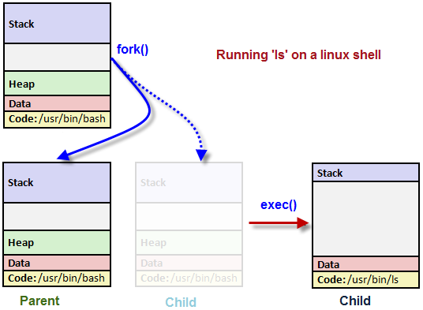
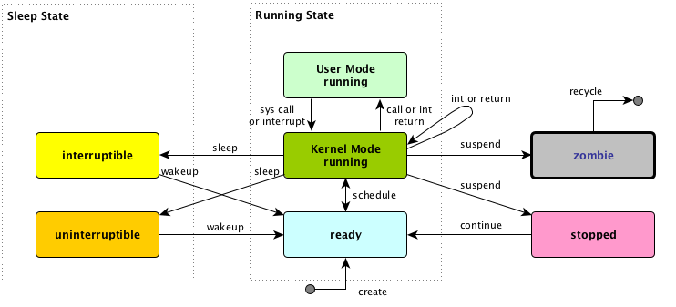

# Software Interrupts

    Course Code: ELEE1119 
    
    Course Name: Advanced Computer Engineering

    Credits: 30

    Module Leader: Seb Blair BEng(H) PGCAP MIET MIHEEM FHEA
    
---

## Processes

Recall that **processes** control almost every task of the system..

Well so do **signals**, or Software Interrupts.

---

## Process Indentification (PID)

Example ouput from `ps -ef`:

```sh
UID        PID  PPID  C STIME TTY          TIME CMD
root         1     0  0  2010 ?        00:01:48 init 
root     21033     1  0 Apr04 ?        00:00:39 crond
root     24765     1  0 Apr08 ?        00:00:01 /usr/sbin/httpd
```
- Between 2 and 32,768 ($2^{15}$ [32 bit]). 
- Between 2 and 4,194,304 ($2^{22}$ [64 bit]). 
- `$ cat /proc/sys/kernel/pid_max`
- When a process is started, the numbers restart from 2, 
- The number 1 is typically reserved for the `init` process as shown in the above example. The process `1` manages other processes, indicated by **Parent** PID `PPID`.

----

## Program - Loading

When you run a program, the code that will be executed is stored in a disk file. In general, a linux process can't write to the memory area. The area is for holding the program code so that the code can be loaded into memory as read-only (so, it can be safely shared).


---

## Process Table

- describes all the processes that are currently loaded
- `ps` command shows the processes
- - it shows only processes that maintain a connection with a terminal, a console, a serial line, or a pseudo terminal
- Other processes that can run without communication with a user on a terminal are system processes that Linux manages shared resources.
- To see all processes, we use `-e` option and `-f` to get full information (`ps -ef`) like last weeks exercise

---

## System Processes

Here is the `STAT` output from `ps`:

```sh
$ ps -ax
  PID TTY      STAT   TIME COMMAND
    1 ?        Ss     1:48 init [3]
    2 ?        S<     0:03 [migration/0]
    3 ?        SN     0:00 [ksoftirqd/0]
 ....
 2981 ?        S<sl  10:14 auditd
 2983 ?        S<sl   3:43 /sbin/audispd
 ....
 3428 ?        SLs    0:00 ntpd -u ntp:ntp -p /var/run/ntpd.pid -g
 3464 ?        Ss     0:00 rpc.rquotad
 3508 ?        S<     0:00 [nfsd4]
 ....
 3812 tty1     Ss+    0:00 /sbin/mingetty tty1
 3813 tty2     Ss+    0:00 /sbin/mingetty tty2
 3814 tty3     Ss+    0:00 /sbin/mingetty tty3
 3815 tty4     Ss+    0:00 /sbin/mingetty tty4
.....
19874 pts/1    R+     0:00 ps -ax
19875 pts/1    S+     0:00 more
21033 ?        Ss     0:39 crond
24765 ?        Ss     0:01 /usr/sbin/httpd
```

<!--
- N = Low priority task, nice
- R = Running or runnable (either executing or about to run)
- S = Sleeping. Usually waiting for an event to occur, such as a signal or input to become available.
- s = The process is a session leader
- < High priority task
- + = The process is in the foreground process group
-->

---

## Process: `init`

```sh
  PID TTY      STAT   TIME COMMAND
    1 ?        Ss     1:48 init [3]
```

- Each **child process** is started by **parent process**.
- When linux starts, it runs a single program, `init`, with process `1`.
  - This is OS process manager, and it's the prime ancestor of **all** processes.
-  Then, other system processes are started by `init` or by other processes started by `init`. 
-  The login procedure is one of the example. The `init` starts the `getty` program once for each terminal that we can use to log in, and it is shown in the `ps`. 

```sh
 3812 tty1     Ss+    0:00 /sbin/mingetty tty1
```

---

## Process: `init` again...

- The `getty` processes **wait** for activity at the terminal, 
  - prompt the user with the login prompt, 
  - then passes control to the login program, 
  - which sets up the user environment, and starts a shell. 
  - When the user shell **exits**, init starts another `getty` **process**.

- The ability to start new processes and to wait for them to finish is fundamental to the system. 

- You can do the same thing within your own programs with the system calls `fork()`, `exec()`, and `wait()`.

---

## System Calls

- A **system call** is a **controlled entry point into the kernel**, allowing a process to request that the kernel perform some action for the process.

- Changes the processor state from user to kernel mode
  - CPU will have access to the protexted kernel memory.
- Kernel has a range of services
  -  using system call application programming interface... (API)


---

## System Calls: `exec()`

- An `exec()` function replaces the current process with a new process specified by the path or file argument.

- Use `exec()` to hand off execution of our program to another.

<table>
<tr>
<td>

- `ls` is ran in the shell
- shell is the parent process
- the shell `forks` at `ls` to create a child process
- child process runs `exec()` to run `ls`
- `exec()` replaces it's self with `ls`

</td>
<td>



</td>
</tr>
</table>

---

## System Calls: `exec()` is c

```c
/* Execute PATH with arguments ARGV and environment from `environ'.  */
extern int execv (__const char *__path, char *__const __argv[])
     __THROW __nonnull ((1));

/* Execute PATH with all arguments after PATH until a NULL pointer,
   and the argument after that for environment.  */
extern int execle (__const char *__path, __const char *__arg, ...)
     __THROW __nonnull ((1));

/* Execute PATH with all arguments after PATH until
   a NULL pointer and environment from `environ'.  */
extern int execl (__const char *__path, __const char *__arg, ...)
     __THROW __nonnull ((1));

/* Execute FILE, searching in the `PATH' environment variable if it contains
   no slashes, with arguments ARGV and environment from `environ'.  */
extern int execvp (__const char *__file, char *__const __argv[])
     __THROW __nonnull ((1));

/* Execute FILE, searching in the `PATH' environment variable if
   it contains no slashes, with all arguments after FILE until a
   NULL pointer and environment from `environ'.  */
extern int execlp (__const char *__file, __const char *__arg, ...)
     __THROW __nonnull ((1)
```

--- 

## Lab -  `execlp()`

```c
#include <unistd.h>
#include <stdio.h>
#include <stdlib.h>

int main()
{
  printf("ps with execlp\n");
  execlp("ps", "ps", 0);
  printf("Done.\n");
  exit(0);
}
```
---

## System Call: `fork()`

- Create a new process by calling `fork()`. 
- This system call duplicates the current process, 
- Creates a new entry in process table with many of the same attributes as the current process. 


---

## Lab - `fork()`

```c
#include <unistd.h>
#include <stdio.h>
#include <stdlib.h>
#include <string.h>

#define BUF_SIZE 150

int main()
{
  int pid = fork();
  char buf[BUF_SIZE];
  int print_count;

  switch (pid)
  {
    case -1:
      perror("fork failed");
      exit(1);
    case 0:
      /* When fork() returns 0, we are in the child process. */
      print_count = 10;
      sprintf(buf,"child process: pid = %d", pid);
      break;
    default: /* + */
      /* When fork() returns a positive number, we are in the parent process
       * (the fork return value is the PID of the newly created child process) */
      print_count = 5;
      sprintf(buf,"parent process: pid = %d", pid);
      break;
  }
  for(;print_count > 0; print_count--) {
      puts(buf);
      sleep(1);
  }
  exit(0);
}

```

---

## System Calls: `wait()`

The primary role of `wait()` is to synchronisation with children.

1. Suspends current process (the parent) until one of its children terminates.

2. Return value is the **pid** of the child process that terminated, and on a successful return, the child process is reaped by the parent.

3. If `child_status != NULL`, the value of the status will be set to indicate why the child process terminated.

4. If parent process has multiple children, `wait()` will return when any of the children terminates.

5. The `waitpid()` can be used to wait on a specific child process.

--- 

## Systems Calls: `wait()`

```c
#include <sys/wait.h>
pid_t wait(int *child_status);
```

- A parent process needs to know when one of its child processes changes state, when the child terminates, hence `wait()` or is stopped by a **signal**, `SIGCHLD`.

- The system call `wait()` blocks the calling process until one of its child processes exits or a signal is received. 

- The `wait()` takes the address of an integer variable and returns the process ID of the completed process.

---

## Lab - `fork()` and `wait()`

```c
#include <unistd.h>
#include <stdio.h>
#include <stdlib.h>
#include <string.h>

#define BUF_SIZE 150

int main()
{
  int pid = fork();
  char buf[BUF_SIZE];
  int print_count;

  switch (pid)
  {
    case -1:
      perror("fork failed");
      exit(1);
    case 0:
      print_count = 10;
      sprintf(buf,"child process: pid = %d", pid);
      break;
    default:
      print_count = 5;
      sprintf(buf,"parent process: pid = %d", pid);
      break;
  }
  if(!pid) {
    int status;
    int pid_child = wait(&status);
  }
  for(;print_count > 0; print_count--) puts(buf);
  exit(0);
}
```

---

## System Calls: `_exit()` and `exit()` Library call

- The `exit()` **library** function is layered on top of the `_exit()` **system** call.
- After a `fork()`, generally only one of the parent and child terminate by calling `exit()` the other process should terminate using `_exit()` 

---

## Zombie Processes

- Either the parent outlives the child or vice versa.

- a process which has terminated but its entry still exists in the process table until the parent terminates normally or calls `wait()`.

- the denotation `defunct` is used to indentify a zombie process.

- The kernel deals with this situation by turning the child into a zombie. This means that most of the resources held by the child are released back to the system to be reused by other processes.

---

## Zombie Process Diagram




--- 

## Process death

- it isn't removed from memory immediately 
- its process descriptor stays in memory (the process descriptor only takes a tiny amount of memory). 
- The process's status becomes `EXIT_ZOMBIE` and the process's parent is notified that its child process has died with the `SIGCHLD` signal. 
- The parent process is then supposed to execute the `wait()` system call to read the dead process's exit status and other information. 
- This allows the parent process to get information from the dead process. After `wait()` is called, the zombie process is completely removed from memory.

---


## Lab - zombies

```c
#include <unistd.h>
#include <stdio.h>
#include <stdlib.h>
#include <string.h>

#define BUF_SIZE 150

int main()
{
  int pid = fork();
  char buf[BUF_SIZE];
  int print_count;

  switch (pid)
  {
    case -1:
      perror("fork failed");
      exit(1);
    case 0:
      print_count = 2;
      sprintf(buf,"child process: pid = %d", pid);
      break;
    default:
      print_count = 10;
      sprintf(buf,"parent process: pid = %d", pid);
      break;
  }
  for(;print_count > 0; print_count--) {
      puts(buf);
      sleep(1);
  }
  exit(0);
}
```
---

## Signals

- Notification from/to OS <--> program/application 

- asynchronous and one-way

- `ctrl`+`c` is one event that triggers a signal if executed in the terminal to stop current process/program.

- Linux kernel has 30 signals, 1 to 31
- No arguments. 
- `SIGKILL` is signal number 9
  - `kill -9 <somepid>` or `kill SIGKILL <somepid>`
- `SIGHUP`  is used to signal that a terminal hangup has occurred, and it has a value of `1`

---

## Signals: KILL and STOP

- With the exception of `SIGKILL` and `SIGSTOP` which always terminates the process or stops the process, respectively, processes may control what happens when they receive a signal. They can:

1. accept the default action, which may be to terminate the process, terminate and coredump the process, stop the process, or do nothing, depending on the signal.
   
2. Or, processes can elect to explicitly ignore or handle signals.
   - **Ignored signals** are silently dropped.
   - **Handled signals** cause the execution of a user-supplied signal handler function. The program jumps to this function as soon as the signal is received, and the control of the program resumes at the previously interrupted instructions.

---

## Signals: 4 Actions

Signals can be:

1. Raised
2. Caught
3. Acted upon
4. Ignored

If a process receives signals such as `SIGFPE`, `SIGKILL`, etc., the process will be terminated immediately, and a **core dump** file is created. The core file is an image of the process, and you can use it to debug.

--- 

## Lab - Signals 

```c
#include <stdio.h>
#include <unistd.h>
#include <signal.h>

void my_signal_interrupt(int sig)
{
  printf("I got signal %d\n", sig);
  (void) signal(SIGINT, SIG_DFL);
}

int main()
{
  (void) signal(SIGINT,my_signal_interrupt);

  while(1) {
      printf("Waiting for interruption...\n");
      sleep(1);
  }
}
```