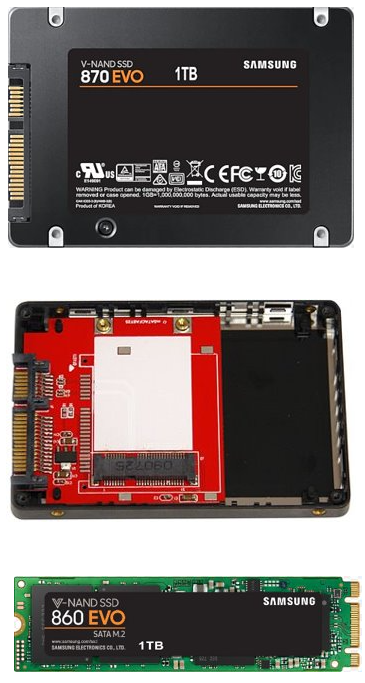
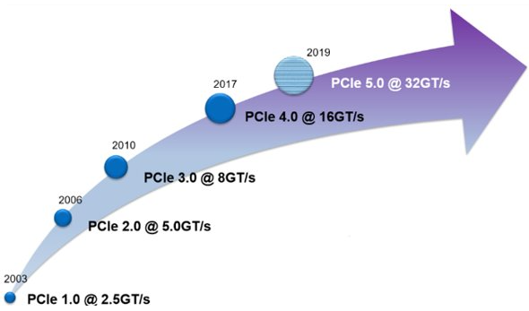
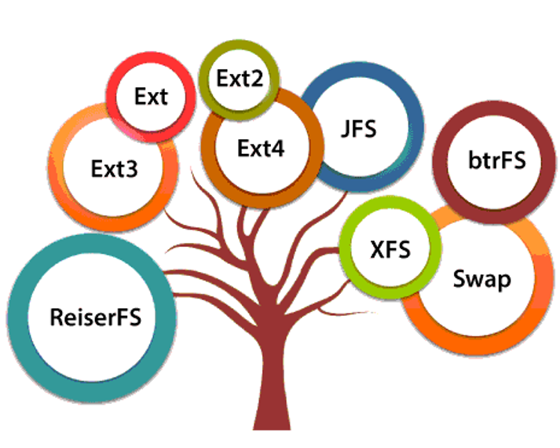
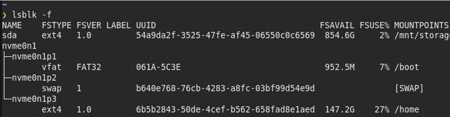
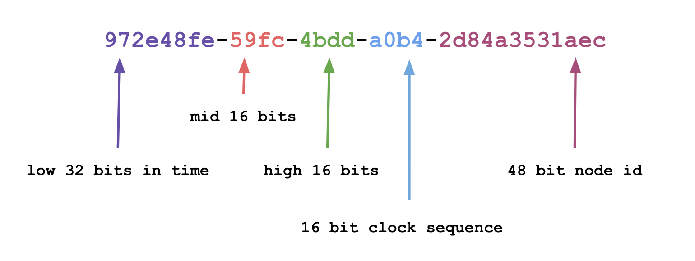
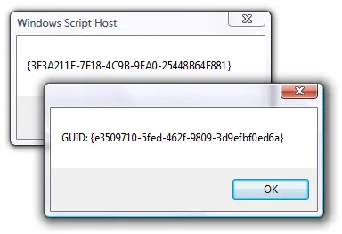
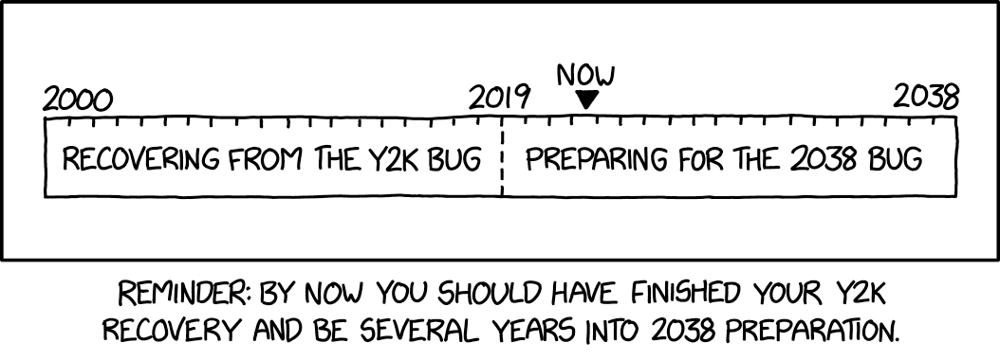
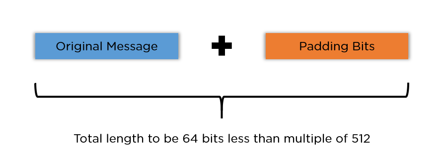
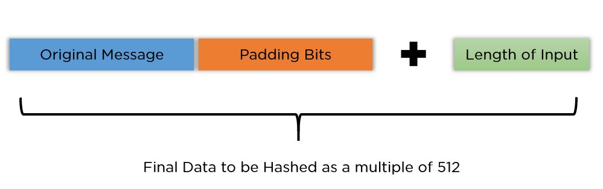
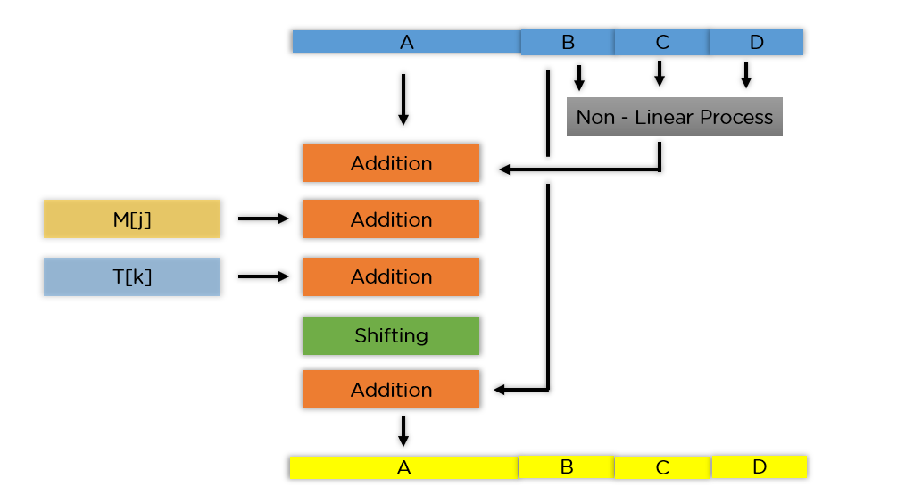

<!-- _footer: "[Download as a PDF](https://github.com/UniOfGreenwich/ELEE1119-Lectures/raw/gh-pages/content/Storage/storage.pdf)" -->

# Storage

    Module Code: ELEE1119 
    
    Module Name: Advanced Computer Engineering

    Credits: 30

    Module Leader: Seb Blair BEng(H) PGCAP MIET MIHEEM FHEA

---

## Byte and Bibytes

  -  $1000 = 10^3 \equiv 1024 = 2^{10}$
  - $1000000 = 10^6 \equiv 1048576 = 2^{20}$
  - ...


$\frac{SI-Bibyte}{SI}\cdot100$


<!--

Years ago, at a time when computer capacities barely matched the few tens of thousands of bytes required by this single web page, computer engineers noticed that the binary 210 (1024) was very nearly equal to the decimal 103 (1000) and, purely as a matter of convenience, they began referring to 1024 bytes as a kilobyte.

-->

---

## Disk Size - False Advertisement?

500GB Storage is actually $\frac{5*10^9}{1,073,741,824} = 465GB$ 

Binry Powers
```sh
NAME        MAJ:MIN RM   SIZE RO TYPE MOUNTPOINTS
nvme0n1     259:0    0 465.8G  0 disk
```

Denary powers
```sh
NAME        MAJ:MIN RM         SIZE RO TYPE MOUNTPOINTS
nvme0n1     259:0    0 500107862016  0 disk
```
---

## Disk Size - your turn...

<div align=right>

$bibytes = \frac{denary}{binary}$

</div>

1. 5 Terabytes
   <details>
   <summary>Answer</summary>

   $$
    \begin{aligned}
     ? &= \frac{5\cdot 10^{12}}{2*{40}} \\ \\
     4.55\ Tebibytes &\approx \frac{5,000,000,000,000}{1,099,511,627,776} \\
    \end{aligned}
   $$

  </details>

2. 32 Gigabytes

    <details>
    <summary>Answer</summary>

    $$
      \begin{aligned}
      ? &= \frac{32\cdot 10^{9}}{2*{30}} \\ \\
      29.80\ Gibibytes &\approx \frac{32,000,000,000}{1,073,741,824} \\
      \end{aligned}
    $$

    </details>

---

## Storage Types

**SSD**: don’t rely on magnets and disks, instead they use a type of flash memory called NAND. In an SSD, semiconductors store information by changing the electrical current of circuits contained within the drive. This means that unlike HDDs, SSDs don’t require moving parts to operate.​

**HDD**: Use magnetic technology to store data and has been around since the 1950. A hard disk drive is comprised of a stack of spinning metal disks known as platters. Each spinning disk has trillions of tiny fragments that can be magnetised in order to represent bits (1s and 0s in binary code).​

---

## Storage Types

**Optical Storage**: CD can store up to 700 MB of data, DVD-DL can store up to 8.5 GB, and Blu-Ray can store between 25 and 128 GB of data.​

**Flash Memory**: A flash memory device contains trillions of interconnected flash memory cells that store data. These cells hold millions of transistors that when switched on or off represent 1s and 0s in binary code, allowing a computer to read and write information.  Currently can store 2 TB of data.​

---
## Types of SSD
- Serial Advanced Technology Attachment (SATA)

- Mini SATA

- SATA M.2



---

## Types of SSD

- Periphal Component Interconnect Express M.2 (PCIE)

- Nov-Volatile Memory Express M.2 (NVME)


---

## SSD Architecture

- NAND flash memory chip
  - array of blocks (grid)
    -  Each grid can store between 256KB and 4MB.
    -  array of memory cells, (pages or sectors)
       -  1-bit cells (Single Level Cells (SLC))
       -  2-bit cells (Multi-Level Cells (MLC))
       -  3-bit cells (Triple-Level Cells (TLC))
       -  4-bit cells (Quad-Level Cells (QLC))


---

## Comparison

||NVME SSD| M.2 SSD| SATA SSD|
|---|---|---|---|
|Speed|PCIE Gen 3 < = 3.5GB/s PCIE Gen 4 <= 7.5GB/s| <= 550MB/s| <= 550MB/s|
|Form Factor|M.2, U.2, PCIE| M.2| 2.5" M.2|
|Interface Types|NVME|SATA, NVME|SATA|
|Adv| High Speeds|Little physical space|Good balance between affordability and speed|
|Dis-Adv|High Costs|More expensive 2.5"| Slower speeds|

---

## PCIE Gen 

- 2.0 - 8b/10b encoding. ​
- 3.0 - 128b​
- 4.0 - 130b encoding technique

4.0's 2 extra bits allows for reasonable clock recovery (extracting timing information from the datastream) and ensures alignment of the datastream. 16GT/s (gigatransfers) which means the maximum theoretical bandwith of PCIe 4.0 is:​ 

15.754Gb$^{-s}$ and 1.54% overhead.

​

---

# File Systems

---

## Linux File System Structure


The file system requires an API to access the function calls to interact with file system components like files and directories. 

The first two parts of the given file system are called a **Linux virtual file system**. It provides a single set of commands for the kernel and developers to access the file system. This virtual file system requires the specific system driver to give an interface to the file system.​

<!--Application Programming Interface-->


---

## Types of Linux File Systems



---

## File Systems

- **New Technology File System** - NTFS partitions can extend up to 16EiB​
Primarily used for Windows and Linux systems. Can't natively write to partition in MAC OS as it lacks the drives. However, third party tools can provide a way to do this.​

- **File Allocation Table** - FAT is a general purpose file system that is compatible with Windows, Linux/Unix and MAC OS. Windows can't deal with anything greater than 32GB or FAT32. FAT suffers from over-fragmentation, file corruption, and limits to file names and size.​

---
## File Systems

- **Extended File Allocation Table** - exFAT is a Microsoft file system with compatibility with MAC OS 10.6+. Used in TVs and portable media players. Can be 512TBs in size. Doesn't work with Linux /Unix. Suffers from defragmentation and cannot pre-allocate disk space.​

- **Hierarchical File System** - Built by Apple for MAC OS X. 8EiBs. Drivers are available for Linux systems to read and write to HFS+​

---

## File Systems

- **Extended File System** - EXT4, was created for Linux Kernels. Can be up to 1 EiB a file can be 16 TB. EXT4 is backward compatible with version 2 and 3. EXT4 can pre-allocated disk space. By default Windows and MAC OS cannon read EXT.​

- **Journal File System** - A high-performance journaling file system, was first developed by Silicon Graphics for the IRIX operating system in 1993. It is the default file system for IRIX version 5.3 and then it was later ported to the Linux kernel.​

---

## File Systems 

- **B-Tree File System** - Btrfs (b-tree fs), was created to address the lack of pooling, snapshots, checksums, and integrated multi-device spanning in Linux file systems, particularly as the need for such features emerged when working at the petabyte scale. ​

- **Zettabyte File System** - Merges the traditional volume management and filesystem layers, and it uses a copy-on-write transactional mechanism—both of these mean the system is very structurally different than conventional filesystems and RAID arrays​

---

## Common Embedded Linux FS

- **ext2/ext3/ext4** - These are Linux based file systems that supports efficient and secure storage of data on hard drives.
- **VFAT** - This is a FAT file system that is commonly used in embedded Linux systems because it is compatible with a variety of operating systems.
- **JFFS2** - This is a journaling flash file system designed specifically for embedded Linux systems.
- **YAFFS** - This is a Yet Another Flash File System designed for embedded Linux systems.
- **UBIFS** - This is an Unsorted Block Image File System that is used to store data on flash memory

---
## Small Computer System Interface Disk (scsi)

 - The first hard disk detected on the SATA by the Linux port, system carries the label sda (sd => scsi disk)​

- The second would be sdb​

- nvme0n1 means first disk detected on the nvme port​



---


## UUIDs

- 32 base 16 characters ([0-9][A-F])

<div align=center>    

$128=32 \cdot log_2(16)$

</div>

- 128 bit numbers

<div align=center>



UUID Version 1 

</div> 

--- 

## UUID Versions

There are 8 versions as of  23 June 2022 

- UUID1 = Timebased + Unique or MAC [no repeats till 3603AD] ​

- UUID2 = Timebased(LSB) + userid​

- UUID3 = Namespace+MD5 hash​

- UUID4 = PRNG [1 trillion UUIDs for a chance of 2 repeats]​

- UUID5 = Namespace + SHA-1 hash​

- UUID6 = Timestamp and monotonic counter.

- UUID7 = UNIX Timestamp

- UUID8 - User defined Data

<!--
(RFC4122 Gregorian calendar no roll overs till 3603)
-->

---

## Who?

- Created by Microsoft but standardised by the **Internet Engineering Task Force** (IETF) and the **International Telecommunication Union** (ITU), so that each user or thing can be uniquely identifiable. 
-  **ITU-T X.667 | ISO/IEC 9834-8**​



    

---

## Where?


<!-- minecraft usese Version 4-->
---


## Combinations: UUID 4 

- $0.0947mm^3$ grain of sand
- UUID4 has 122 random bits, $5.3e36$
- $5.0191e34mm^3 =5.3e36 \cdot 0.0947mm^3$
- Volume of sand as UUID4 = $50,190,000,000,000,008km^3$

...and the volume of Jupiter 

- $1,431,281,810,739,360km^3$


<!--
50 quadrillion, 190 trillion and 8

1 quadrillion 434 trillion 281 billion 810 million 739 thousand and 360
-->

---

## Uniqueness: UUID4

- In the version 4, 6 bits are fixed and the remaining 122 bits are randomly generated, for a total of $2^{122}$ possible UUIDs.
- $n = 2^{122}$
- So if the number of generated UUIDs exceeds $r > n$ then there must be duplicates

- If you assume perfect randomness you would expect to see collison after $2^{61}$
- $2^{58} \approx 24,913,440,000,000,000 =7.2e9\cdot 365 \cdot 24\cdot 60 \cdot 60$
- After a few years you would get the first collisions.

<!--
The first UUID can be any of n possibilities, the second can be any of the n except the first (n-1), the third can be any except for the first two (n-2), and so on.

And the total number of ways to generate r UUIDs is n^r since each of the r UUIDs has n different possibilities. 

24 quadrillion 943 trillion 440 billion 
-->

---

## UUID 1

- combination of:
 
  -  current time and date.
     - RFC 4122 60-bit count of 100$ns$  since  00:00:00:00 15 October 1582 to 01/01/1970 
     - $122192928000000000ns$
     - Current date time since 00:00:00:00 01 January 1970

$1799684520607795200ns = 1677491592607795200  + 122192928000000000$
  -  48-bit MAC address of the host machine

<!--
Gregorian Calendar 15/10/1582

- The Gregorian calendar, also known as the Western calendar, is the most widely used calendar in the world today. Its predecessor, the Julian calendar, was replaced because it did not correctly reflect the actual time it takes the Earth to circle once around the Sun, known as a tropical year.

Unix 01/01/1970

- The year 2038 problem is related to Unix time because times after 03:14:07 UTC on 19 January 2038 will require computers to store the value as greater than 32-bits.
-->
---
## Epochs/Time

- 01/01/1970
  - Unix engineers set the arbitrary datetime stamp because... it was convenient...
-  19/01/2038 03:14:07 the storage for 32-bit will become obsolete, as the value will be too large
   - Will need to migrate to 64-bit or just deal with the timestamp showing:
      - 19/01/1901 03:14:08
  



  <!--

   Years designed as two digits not four.

  In January, a World Bank report estimated that only 21 of 139 developing countries had taken concrete steps to address the year 2000 problem. The report went on to anticipate year 2000 impacts on power, telecommunications, energy, food distribution and medical care in developing countries

   hundreds of billions of dollars spent to kill off the bug worldwide, Y2K ended as mere only glitches.

  -->

---

## UUID 1: Time format
|Name| Bytes|Hex|Bits|Comments|
|---|----|----|----|---|
|time_low|4|8|32|integer giving the low 32-bits of time|
|time_high|2|4|16|integer giving the middle 16-bits of time|
|time_hi_version|2|4|16|4-bits representing the "version" and the followinghigh 12 bits of time|
|clock_seq_hi_and_res clock_seq_low|	2|	4|	16|	1 to 3-bit "variant" in the most significant bits, followed by the 13 to 15-bit clock sequence|

---

## Example
```sh
$ date +"%s.%N" | awk -F "." '{print "(nano seconds = )", (($1*1000000000)+122192928000000000+$2)}'
> (nano seconds = ) 1799602340604762112
```
- Time Low = 04762112 -> 0048AA00
  ```sh
   $ printf "%016X" 04762112 | awk -F "%" '{print $1}'
   > 000000000048AA00
  ```
- Time High = 0fe0 -> 0F29
- Time High+Version = 1179 -> 049B
- Clock_seq = is random bits say a number between 1000-9999 and replace the MSB with the variant number 0x10xx. 
- 0048AA00-0F29-049B-25D9-[MAC|random 48-bits]

 
---
## UUID 2
- Distributed Computing Environment (DCE)
- combination of:
  -  Current time and date.
  -  The local identifier replaces the lower 32 bits of the timestamp.48-bit MAC address of the host machine
       -  Domain Name or Hostname
          ```sh
          $ id -u; id -g; whoami;
          ```
  -  MacAddress or random generated Hex
      ```sh
      cat -A /dev/urandom | less
      ```
---
## UUID 3

- namespace could be website, DNS information, plain text, etc
- the namespace value is hashed using the `md5hash` alogrithm


---

## MD5 Algorithm




---

## MD5 Alogrithm



- Round 1: (b AND c) OR ((NOT b) AND (d))

- Round 2: (b AND d) OR (c AND (NOT d))

- Round 3: b XOR c XOR d

- Round 4: c XOR (b OR (NOT d))

<!--
Each 512-bit block gets broken down further into 16 sub-blocks of 32 bits each. There are four rounds of operations, with each round utilizing all the sub-blocks, the buffers, and a constant array value. 

This constant array can be denoted as T[1] -> T[64].

Each of the sub-blocks are denoted as M[0] -> M[15].
-->
---

## UUID​4


1. Generate 128 random bits:

```sh
dd if=/dev/random count=16 bs=1 2> /dev/null | xxd -ps
> 567D61C2EE3B23914141110256D2385
```

<div align=center>

00000101 01100111 11010110 00011100 00101110 11100011 **10110010** 00111001 **00010100** 00010100 00010001 00010000 00100101 01101101 00100011 10000101 

</div>
    
2. Take the 7th byte and perform an AND operation with `0x0F` to clear out the high nibble. Then, OR it with `0x40` to set the version number to 4.

<div align=center>

00000010  = **10110010** & 00001111​ (0x0f)

01000010  = **00000010** |  01000000 (0x40)

</div>


<!--
Command
- dd == data defintion
arguments 
- if == read from FILE instead of stdin
- count == Copy N blocks
- bs == read/write byes 1 at a time
- 2> errors redirected to blackhole
Command
- xxd == hexdump
  - ps == plain text from beginnning of stream
-->

---

## UUID4 Example 

3. Next, take the 9th byte and perform an AND operation with `0x3F` and then OR it with `0x80`.

<div align=center>

00010100  = **00010100** & 00111111​ (0x3f)

10010100  = **00010100** |  10000000 (0x80)

</div>

4. Convert the 128 bits to hexadecimal representation and insert the hyphens to achieve the canonical text representation.​

<div align=center>

567D61C2-EE30-4299-4141-110256D2385​

</div>

---

## Your Turn

<div align=center>

10101110 00100001 10110100 11111100 01101111 01110010 **10100011** 00110010 **10111010** 10000110 11010010 00001001 11010001 11100000 10101111 01101001 ​

</div>​

2. Take the 7th byte and perform an AND operation with `0x0F` to clear out the high nibble. Then, OR it with `0x40` to set the version number to 4.​

3. Next, take the 9th byte and perform an AND operation with `0x3F` and then OR it with `0x80`.​

4. Convert the 128 bits to hexadecimal representation and insert the hyphens to achieve the canonical text representation.​

<details>
<summary>Answer</summary>

<div align=center>

Before: AE21B4FC-6F72-A332-BA86-D209D1E0AF69

After: AE21B4FC-6F72-**43**32-**BA**86-D209D1E0AF69

</div>
</details>

---

## UUID 5

- namespace could be website, DNS information, plain text, etc
- the namespace value is hashed using the `sha1sum` alogrithm


---

## Everything is a File...

**Inodes**
- It is used to record the metadata of the file, such as the inode number, file size, access rights, modification date, data location, etc. One file has one associated inode, and like file content, inode stores on disk.

**Directories**
- D(d)entry for short, is used to record the name of the file, the inode pointer, and the association with other directory entries. ​

- Multiple associated directory entries constitute the directory structure of the file system. ​

- However, unlike inodes, a directory entry is an in-memory data structure maintained by the kernel, so it is often called a directory entry cache.​

---

## Superblock Information


<!--
The primary copy of superblock is stored in the very first block group. because this is the superblock that is read by the system when you mount the file system. 

As block groups are counted from 0, we can say that the primary superblock is stored at the beginning of block group 0.

As superblock is a very critical component of the file system, a backup redundant copy is placed at each "block group".

In other words, every "block group" in the file system will have the backup superblock. This is basically done to recover the superblock if the primary one gets corrupted.
-->

---

## File, Inode, Address_Space


```c
struct address_space_operations{​
    int (*writepage)(struct page *page, struct writeback_control *wbc);​
    int (*readpage)(struct file *, struct page *);​
    /* write back some dirty pages from this mapping */​
    int (*writepages)(struct address_space *, struct writebackcontrol *);​
    /* set a page dirty. Return true if this dirited it */​
    int (*set_page_dirty)(stuct page *page)​
    int (*readpages)(struct, file *filp, struct address_space *mapping, ​
                                struct list_head *pages, unsigned nr_pages);​
    …​
}​
```
---

## Strace

Tracing system calls and signals

