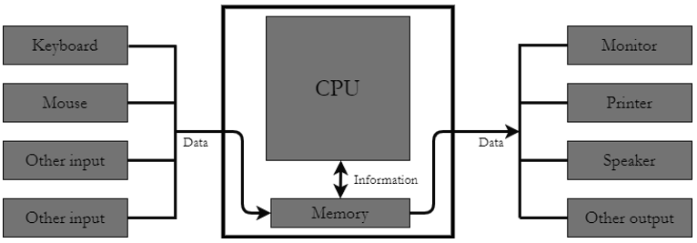
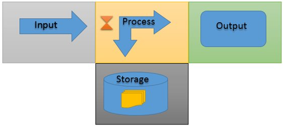
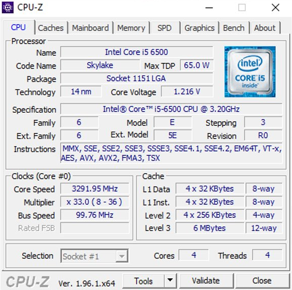

# What is a computer?

    Module Code: ELEE1119

    Module Name: Advanced Computer Engineering

    Credits: 30

    Module Leader: Seb Blair BEng(H) PGCAP MIET MHIEEM FHE

---

## Computer Interface
---

## 4 Layers 

- Layer 4: Applications (OS)​
>>
- Layer 3: Kernel​
>>
- Layer 2: Hardware Abstraction Layer​ (HAL)​
>>

- Layer 1: CPU Memory MMU, Timers and  Ports/Devices​

---

## Level 4: OS 1

- An Operating System (OS) is considered the most important software that runs on an computer. ​

- It allows users to operate and  communicate with the hardware on the computer.​

- Ergo a Computer useless without the OS.​

- OS manages all the **Software** and  **Hardware**  on the computer
  
---

## Operating Systems

Types of OS generally come in three flavours:​

   1. Microsoft Windows (Win 11, Win10, XP, VISTA, 3.0)​

   2. MacOS (Cheetah, Puma, Big Sur)​

   3. Linux (distros-> Ubuntu, Redhat, Kali)​
   4. Dos​

---
## Level 3: Kernel

---
## Kernel...

 - The kernel is a busy personal assistant for a powerful executive (the **hardware**). ​

 - It’s the assistant’s job to relay messages and requests (**processes**) from employees and the public (**users**) to the executive. ​

- To remember what is stored where (**memory**).​

 - To determine who has access to the executive at any given time and for how long.​

---

## Kernel...

If implemented properly the Kernel is invisible to the user, working in its own little world known as the **Kernel Space**. Like where it allocates memory and track of where everything is stored. The **User Space** is the files or applications, what the user sees!​

​

The Kernel is **software​**

---

##

---

## Level 2: Hardware Abstraction Layer (HAL)

The HAL handles the communication between the Kernel of the OS and the Hardware​

---
## Level 1: Hardware

Basic components of modern digital computer are:​

- Input/Output device (I/O)​

- Central Processing Unit (CPU)​

- Mass Storage Device​

- Memory

---

## Functions of a Computer​

So therefore the four main functions of a computer are:​​

1. Input
>>
2. Processing
>>
3. Output
>>
4. Storage

---

## What parts are needed for a computer work?

**Processor​**

 - Component that executes instructions from the software and hardware​

**Memory​**

- Temporary primary storage for data travelling between storage and CPU​

**Motherboard​**

- Component that connects all components.​

**Storage Device​**

- Slower Secondary storage that permanently stores data.

---

## But wait, there are other types of computers

<table>
<tr>
<td>

By Type
 - Analogue
 - Digital
 - Hybrid

</td>
<td>

By Size
- Micro
- Mini
- Mainframe
- Super

</td>
<td>

By Purpose
- General
- Special

</td>
</tr>
<tr>
<td>

</td>
<td>

</td>
<td>

</td>
</tr>
</table>

---
## Back to the Architecture

Now we are going to have a look at the CPU and in part the memory and how they are related.​

---
## Central Processing Unit

- Chipset dictates what type of CPU you have​

- Likewise because the CPU has the memory controller built-in this dictates what Chipset you have.

- DMI (Direct Media Interface ) a high speed BUS (data highway , ‘omnibus’ [Latin])​

- Chips controls the flow of data and instructions to the CPU​

---

## Cores

- CPU have multiple cores​

- Own CU, ALU and registers​

- Independently processing programming instruction​

- Software can take advantage of this and therefore double number of cores double rate of execution.​

---

## Cache Levels

---

## Crystal Oscillator -  Base Clock

- 100 million times a second – cycle is 10ns​

- Base clock, tempo, is multiplied by a frequency multiplier to increase the rate of instructions executed​

- Multiplying by 35 we get 3.5Ghz, which 0.3ns per cycle​
  

​

---

## Overclocking

Overclocking, suppling more voltage to the crystal to increase the frequency.​

Means faster system, calculations, instructions etc. ​

More power more heat

$$
\begin{aligned}

  P &= v^2Cf \\ 
  1.862kW &= 5^2(1.33 \cdot 10^-8F)\cdot 5.6 \cdot 10^9)\\

\end{aligned}
$$

---

## Example CPU

**Core speed** is the multiplication result, per core

**Multiplier** CPU dynamically adjust clock speed​

**Bus Speed** Base clock frequency from the Quartz crystal​

---

## Example Cache

**L1 Cache** is​ In two parts, Instruction and ​Data. Both are 32 KBytes in size​

**L2 Cache** as expected is larger at 256 Bytes​

**L3 Cache** Finally, L3 is 6M bytes 

---

## Example Memory

**DRAM:Frequency** Speed of the memory bus​

**FSB:DRAM** Base clock /3 * up to get **DRAM** Frequency ​

Column Address Strobe (**CAS**) latency, or CL, is the delay in clock cycles between the READ command and the moment data is available. Smaller the number the better​

